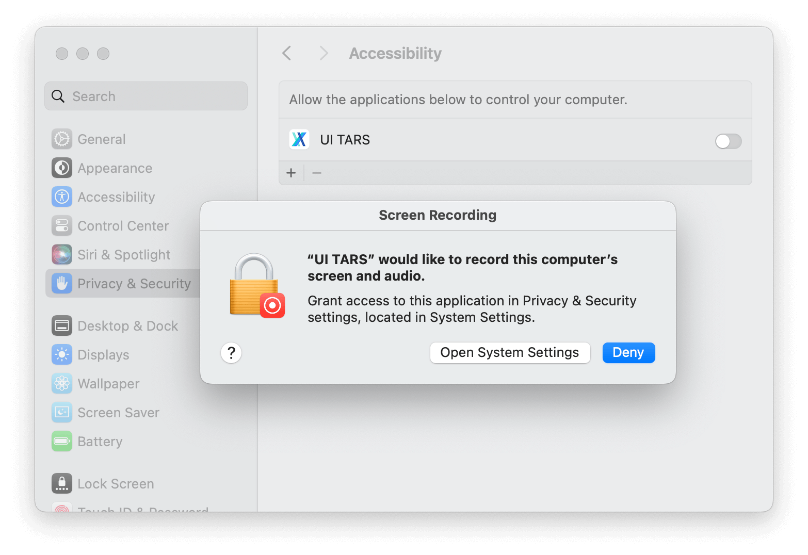

<p align="center">
  
</p>

# UI-TARS Desktop

UI-TARS Desktop is a GUI Agent application based on [UI-TARS (Vision-Language Model)](https://github.com/bytedance/UI-TARS) that allows you to control your computer using natural language.


<p align="center">
        &nbsp&nbsp 📑 <a href="https://arxiv.org/abs/2501.12326">Paper</a> &nbsp&nbsp
        | 🤗 <a href="https://huggingface.co/bytedance-research/UI-TARS-7B-DPO">Hugging Face Models</a>&nbsp&nbsp
        | &nbsp&nbsp🫨 <a href="https://discord.gg/pTXwYVjfcs">Discord</a>&nbsp&nbsp
        | &nbsp&nbsp🤖 <a href="https://www.modelscope.cn/models/bytedance-research/UI-TARS-7B-DPO">ModelScope</a>&nbsp&nbsp
<br>
🖥️ Desktop Application &nbsp&nbsp
| &nbsp&nbsp 👓 <a href="https://github.com/web-infra-dev/midscene">Midscene (use in browser)</a>
</p>

### ⚠️ Important Announcement: GGUF Model Performance

The **GGUF model** has undergone quantization, but unfortunately, its performance cannot be guaranteed. As a result, we have decided to **downgrade** it.

💡 **Alternative Solution**:
You can use **[Cloud Deployment](#cloud-deployment)** or **[Local Deployment [vLLM]](#local-deployment-vllm)**(If you have enough GPU resources) instead.

We appreciate your understanding and patience as we work to ensure the best possible experience.

## Updates

- 🚀 01.25: We updated the **[Cloud Deployment](#cloud-deployment)** section in the 中文版: [GUI模型部署教程](https://bytedance.sg.larkoffice.com/docx/TCcudYwyIox5vyxiSDLlgIsTgWf#U94rdCxzBoJMLex38NPlHL21gNb) with new information related to the ModelScope platform. You can now use the ModelScope platform for deployment.

## Showcases

| Instruction  | Video |
| :---:  | :---: |
| Get the current weather in SF using the web browser      |    <video src="https://github.com/user-attachments/assets/5235418c-ac61-4895-831d-68c1c749fc87" height="300" />    |
| Send a twitter with the content "hello world"   | <video src="https://github.com/user-attachments/assets/737ccc11-9124-4464-b4be-3514cbced85c" height="300" />        |

## Features

- 🤖 Natural language control powered by Vision-Language Model
- 🖥️ Screenshot and visual recognition support
- 🎯 Precise mouse and keyboard control
- 💻 Cross-platform support (Windows/MacOS)
- 🔄 Real-time feedback and status display
- 🔐 Private and secure - fully local processing

## Quick Start

### Download

You can download the [latest release](https://github.com/bytedance/UI-TARS-desktop/releases/latest) version of UI-TARS Desktop from our releases page.

> **Note**: If you have [Homebrew](https://brew.sh/) installed, you can install UI-TARS Desktop by running the following command:
> ```bash
> brew install --cask ui-tars
> ```

### Install

#### MacOS

1. Drag **UI TARS** application into the **Applications** folder
  

2. Enable the permission of **UI TARS** in MacOS:
  - System Settings -> Privacy & Security -> **Accessibility**
  - System Settings -> Privacy & Security -> **Screen Recording**
  

3. Then open **UI TARS** application, you can see the following interface:
  


#### Windows

**Still to run** the application, you can see the following interface:


### Deployment

#### Cloud Deployment
We recommend using HuggingFace Inference Endpoints for fast deployment.
We provide two docs for users to refer:

English version: [GUI Model Deployment Guide](https://juniper-switch-f10.notion.site/GUI-Model-Deployment-Guide-17b5350241e280058e98cea60317de71)

中文版: [GUI模型部署教程](https://bytedance.sg.larkoffice.com/docx/TCcudYwyIox5vyxiSDLlgIsTgWf#U94rdCxzBoJMLex38NPlHL21gNb)

#### Local Deployment [vLLM]
We recommend using vLLM for fast deployment and inference. You need to use `vllm>=0.6.1`.
```bash
pip install -U transformers
VLLM_VERSION=0.6.6
CUDA_VERSION=cu124
pip install vllm==${VLLM_VERSION} --extra-index-url https://download.pytorch.org/whl/${CUDA_VERSION}

```
##### Download the Model
We provide three model sizes on Hugging Face: **2B**, **7B**, and **72B**. To achieve the best performance, we recommend using the **7B-DPO** or **72B-DPO** model (based on your hardware configuration):

- [2B-SFT](https://huggingface.co/bytedance-research/UI-TARS-2B-SFT)
- [7B-SFT](https://huggingface.co/bytedance-research/UI-TARS-7B-SFT)
- [7B-DPO](https://huggingface.co/bytedance-research/UI-TARS-7B-DPO)
- [72B-SFT](https://huggingface.co/bytedance-research/UI-TARS-72B-SFT)
- [72B-DPO](https://huggingface.co/bytedance-research/UI-TARS-72B-DPO)


##### Start an OpenAI API Service
Run the command below to start an OpenAI-compatible API service:

```bash
python -m vllm.entrypoints.openai.api_server --served-model-name ui-tars --model <path to your model>
```

##### Input your API information


<!-- If you use Ollama, you can use the following settings to start the server:

```yaml
VLM Provider: ollama
VLM Base Url: http://localhost:11434/v1
VLM API Key: api_key
VLM Model Name: ui-tars
``` -->

> **Note**: VLM Base Url is OpenAI compatible API endpoints (see [OpenAI API protocol document](https://platform.openai.com/docs/guides/vision/uploading-base-64-encoded-images) for more details).

## Development

Just simple two steps to run the application:

```bash
pnpm install
pnpm run dev
```

> **Note**: On MacOS, you need to grant permissions to the app (e.g., iTerm2, Terminal) you are using to run commands.

### Testing

```bash
# Unit test
pnpm run test
# E2E test
pnpm run test:e2e
```

## System Requirements

- Node.js >= 20
- Supported Operating Systems:
  - Windows 10/11
  - macOS 10.15+

## License

UI-TARS Desktop is licensed under the Apache License 2.0.

## Citation
If you find our paper and code useful in your research, please consider giving a star :star: and citation :pencil:

```BibTeX
@article{qin2025ui,
  title={UI-TARS: Pioneering Automated GUI Interaction with Native Agents},
  author={Qin, Yujia and Ye, Yining and Fang, Junjie and Wang, Haoming and Liang, Shihao and Tian, Shizuo and Zhang, Junda and Li, Jiahao and Li, Yunxin and Huang, Shijue and others},
  journal={arXiv preprint arXiv:2501.12326},
  year={2025}
}
```
