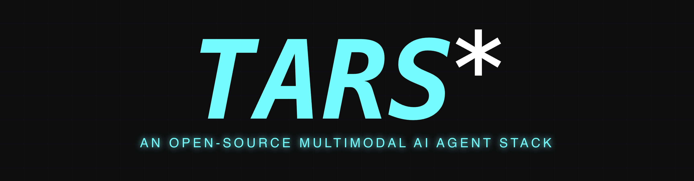

<picture>
  
</picture>


## Introduction

[English](./README.md) | 简体中文

[](https://trendshift.io/repositories/13584)

<b>TARS<sup>\*</sup></b> 是一个多模态 AI Agent Stack，目前包含两个项目：[Agent TARS](#agent-tars) 和 [UI-TARS-desktop](#ui-tars-desktop)：

<table>
  <thead>
    <tr>
      <th width="50%" align="center"><a href="#agent-tars">Agent TARS</a></th>
      <th width="50%" align="center"><a href="#ui-tars-desktop">UI-TARS-desktop</a></th>
    </tr>
  </thead>
  <tbody>
    <tr>
      <td align="center">
        <video src="https://github.com/user-attachments/assets/c9489936-afdc-4d12-adda-d4b90d2a869d" width="50%"></video>
      </td>
      <td align="center">
        <video src="https://github.com/user-attachments/assets/e0914ce9-ad33-494b-bdec-0c25c1b01a27" width="50%"></video>
      </td>
    </tr>
    <tr>
      <td align="left">
        <b>Agent TARS</b> 是一个通用的多模态 AI Agent Stack，它将 GUI Agent 和 Vision 的强大功能带入你的终端、计算机、浏览器和产品中。
        <br>
        <br>
        它主要提供 <a href="https://agent-tars.com/guide/basic/cli.html" target="_blank">CLI</a> 和 <a href="https://agent-tars.com/guide/basic/web-ui.html" target="_blank">Web UI</a> 供使用。
        旨在通过前沿的多模态 LLMs 和与各种现实世界 <a href="https://agent-tars.com/guide/basic/mcp.html" target="_blank">MCP</a> 工具的无缝集成，提供更接近人类任务完成方式的工作流程。
      </td>
      <td align="left">
        <b>UI-TARS Desktop</b> 是一个桌面应用程序，基于 <a href="https://github.com/bytedance/UI-TARS" target="_blank">UI-TARS</a> 模型提供原生的 GUI Agent。
        <br>
        <br>
        它主要提供
        <a href="https://github.com/bytedance/UI-TARS-desktop/blob/docs/new-readme/docs/quick-start.md#get-model-and-run" target="_blank">本地</a>和
        <a href="https://github.com/bytedance/UI-TARS-desktop/blob/docs/new-readme/docs/quick-start.md#try-out-our-free-remote-operators" target="_blank">远程</a>计算机以及浏览器操作器。
      </td>
    </tr>
  </tbody>
</table>

## Table of Contents

<!-- START doctoc generated TOC please keep comment here to allow auto update -->
<!-- DON'T EDIT THIS SECTION, INSTEAD RE-RUN doctoc TO UPDATE -->

- [News](#news)
- [Agent TARS](#agent-tars)
  - [Showcase](#showcase)
  - [Core Features](#core-features)
  - [Quick Start](#quick-start)
  - [Documentation](#documentation)
- [UI-TARS Desktop](#ui-tars-desktop)
  - [Showcase](#showcase-1)
  - [Features](#features)
  - [Quick Start](#quick-start-1)
- [Contributing](#contributing)
- [License](#license)
- [Citation](#citation)

<!-- END doctoc generated TOC please keep comment here to allow auto update -->

## News

- **\[2025-06-25\]** 我们发布了 Agent TARS Beta 和 Agent TARS CLI - [Introducing Agent TARS Beta](https://agent-tars.com/blog/2025-06-25-introducing-agent-tars-beta.html)，这是一个多模态 AI agent，旨在通过丰富的多模态能力（如 GUI Agent、Vision）和与各种现实世界工具的无缝集成，探索更接近人类任务完成方式的工作形式。
- **\[2025-06-12\]** - 🎁 我们很高兴宣布发布 UI-TARS Desktop v0.2.0！此次更新引入了两个强大的新功能：**Remote Computer Operator** 和 **Remote Browser Operator**—— 完全免费。无需配置：只需点击即可远程控制任何计算机或浏览器，体验全新的便利和智能水平。
- **\[2025-04-17\]** - 🎉 我们很高兴宣布发布全新的 UI-TARS Desktop 应用程序 v0.1.0，具有重新设计的 Agent UI。该应用程序增强了计算机使用体验，引入了新的浏览器操作功能，并支持[先进的 UI-TARS-1.5 模型](https://seed-tars.com/1.5)以提供更好的性能和精确控制。
- **\[2025-02-20\]** - 📦 推出了 [UI TARS SDK](./docs/sdk.md)，这是一个强大的跨平台工具包，用于构建 GUI 自动化 agent。
- **\[2025-01-23\]** - 🚀 我们更新了**[Cloud Deployment](./docs/deployment.md#cloud-deployment)**部分的中文版：[GUI模型部署教程](https://bytedance.sg.larkoffice.com/docx/TCcuNPlHL21gNb)，其中包含与 ModelScope 平台相关的新信息。你现在可以使用 ModelScope 平台进行部署。

<br>

## Agent TARS

<p>
    <a href="https://npmjs.com/package/@agent-tars/cli?activeTab=readme"></a>
    <a href="https://npmcharts.com/compare/@agent-tars/cli?minimal=true"></a>
    <a href="https://nodejs.org/en/about/previous-releases"></a>
    <a href="https://discord.gg/HnKcSBgTVx"></a>
    <a href="https://twitter.com/agent_tars"></a>
    <a href="https://applink.larkoffice.com/client/chat/chatter/add_by_link?link_token=279h3365-b0fa-407f-89f3-0f96f36cd4d8"></a>
    <a href="https://deepwiki.com/bytedance/UI-TARS-desktop"></a>
</p>

<b>Agent TARS</b> 是一个通用的多模态 AI Agent Stack，它将 GUI Agent 和 Vision 的强大功能带入你的终端、计算机、浏览器和产品中。 <br> <br>
它主要提供 <a href="https://agent-tars.com/guide/basic/cli.html" target="_blank">CLI</a> 和 <a href="https://agent-tars.com/guide/basic/web-ui.html" target="_blank">Web UI</a> 供使用。
旨在通过前沿的多模态 LLMs 和与各种现实世界 <a href="https://agent-tars.com/guide/basic/mcp.html" target="_blank">MCP</a> 工具的无缝集成，提供更接近人类任务完成方式的工作流程。

### Showcase

```
请帮我在 Priceline 上预订 9 月 1 日从圣何塞到纽约最早的航班，以及 9 月 6 日最晚的返程航班
```

https://github.com/user-attachments/assets/772b0eef-aef7-4ab9-8cb0-9611820539d8

<br>

<table>
  <thead>
    <tr>
      <th width="50%" align="center">预订酒店</th>
      <th width="50%" align="center">使用额外的 MCP Servers 生成图表</th>
    </tr>
  </thead>
  <tbody>
    <tr>
      <td align="center">
        <video src="https://github.com/user-attachments/assets/c9489936-afdc-4d12-adda-d4b90d2a869d" width="50%"></video>
      </td>
      <td align="center">
        <video src="https://github.com/user-attachments/assets/a9fd72d0-01bb-4233-aa27-ca95194bbce9" width="50%"></video>
      </td>
    </tr>
    <tr>
      <td align="left">
        <b>指令：</b> <i>我 9 月 1 日到 9 月 6 日在洛杉矶，预算 5000 美元。请帮我在 booking.com 上预订离机场最近的丽思卡尔顿酒店，并为我编制一份交通指南</i>
      </td>
      <td align="left">
        <b>指令：</b> <i>为我绘制杭州一个月的天气图表</i>
      </td>
    </tr>
  </tbody>
</table>

更多用例，请查看 [#842](https://github.com/bytedance/UI-TARS-desktop/issues/842)。

### Core Features

- 🖱️ **一键开箱即用的 CLI** - 支持 **有界面** [Web UI](https://agent-tars.com/guide/basic/web-ui.html) 和 **无界面** [server](https://agent-tars.com/guide/advanced/server.html) [执行](https://agent-tars.com/guide/basic/cli.html)。
- 🌐 **混合 Browser Agent** - 使用 [GUI Agent](https://agent-tars.com/guide/basic/browser.html#visual-grounding)、[DOM](https://agent-tars.com/guide/basic/browser.html#dom) 或混合策略控制浏览器。
- 🔄 **Event Stream** - 协议驱动的 Event Stream 驱动 [Context Engineering](https://agent-tars.com/beta#context-engineering) 和 [Agent UI](https://agent-tars.com/blog/2025-06-25-introducing-agent-tars-beta.html#easy-to-build-applications)。
- 🧰 **MCP Integration** - 内核构建在 MCP 之上，同时支持挂载 [MCP Servers](https://agent-tars.com/guide/basic/mcp.html) 来连接现实世界的工具。

### Quick Start


```bash
# 使用 `npx` 启动。
npx @agent-tars/cli@latest

# 全局安装，需要 Node.js >= 22
npm install @agent-tars/cli@latest -g

# 使用你喜欢的模型提供商运行
agent-tars --provider volcengine --model doubao-1-5-thinking-vision-pro-250428 --apiKey your-api-key
agent-tars --provider anthropic --model claude-3-7-sonnet-latest --apiKey your-api-key
```

访问完整的 [Quick Start](https://agent-tars.com/guide/get-started/quick-start.html) 指南获取详细的设置说明。

### Documentation

> 🌟 **探索 Agent TARS Universe** 🌟

<table>
  <thead>
    <tr>
      <th width="20%" align="center">分类</th>
      <th width="30%" align="center">资源链接</th>
      <th width="50%" align="left">描述</th>
    </tr>
  </thead>
  <tbody>
    <tr>
      <td align="center">🏠 <strong>核心枢纽</strong></td>
      <td align="center">
        <a href="https://agent-tars.com">
          
        </a>
      </td>
      <td align="left">进入 Agent TARS 生态系统的入口</td>
    </tr>
      <tr>
      <td align="center">📚 <strong>Quick Start</strong></td>
      <td align="center">
        <a href="https://agent-tars.com/guide/get-started/quick-start.html">
          
        </a>
      </td>
      <td align="left">5 分钟从零快速上手</td>
    </tr>
    <tr>
      <td align="center">🚀 <strong>最新动态</strong></td>
      <td align="center">
        <a href="https://agent-tars.com/beta">
          
        </a>
      </td>
      <td align="left">发现前沿功能和愿景</td>
    </tr>
    <tr>
      <td align="center">🛠️ <strong>开发者专区</strong></td>
      <td align="center">
        <a href="https://agent-tars.com/guide/get-started/introduction.html">
          
        </a>
      </td>
      <td align="left">掌握每个命令和功能</td>
    </tr>
    <tr>
      <td align="center">🎯 <strong>Showcase</strong></td>
      <td align="center">
        <a href="https://github.com/bytedance/UI-TARS-desktop/issues/842">
          
        </a>
      </td>
      <td align="left">查看官方和社区构建的用例</td>
    </tr>
    <tr>
      <td align="center">🔧 <strong>参考文档</strong></td>
      <td align="center">
        <a href="https://agent-tars.com/api/">
          
        </a>
      </td>
      <td align="left">完整的技术参考</td>
    </tr>
  </tbody>
</table>

<br/>
<br/>
<br/>

## UI-TARS Desktop

<p align="center">
  
</p>

UI-TARS Desktop 是一个由 [UI-TARS](https://github.com/bytedance/UI-TARS) 和 Seed-1.5-VL/1.6 系列模型驱动的原生 GUI agent，可在你的本地计算机和云端远程 VM 沙箱上使用。

<div align="center">
<p>
        &nbsp&nbsp 📑 <a href="https://arxiv.org/abs/2501.12326">Paper</a> &nbsp&nbsp
        | 🤗 <a href="https://huggingface.co/ByteDance-Seed/UI-TARS-1.5-7B">Hugging Face Models</a>&nbsp&nbsp
        | &nbsp&nbsp🫨 <a href="https://discord.gg/pTXwYVjfcs">Discord</a>&nbsp&nbsp
        | &nbsp&nbsp🤖 <a href="https://www.modelscope.cn/collections/UI-TARS-bccb56fa1ef640">ModelScope</a>&nbsp&nbsp
<br>
🖥️ Desktop Application &nbsp&nbsp
| &nbsp&nbsp 👓 <a href="https://github.com/web-infra-dev/midscene">Midscene (use in browser)</a> &nbsp&nbsp
</p>

</div>

### Showcase

<!-- // FIXME: Choose only two demo, one local computer and one remote computer showcase. -->

|                                                          指令                                                           |                                                本地操作器                                                |                                               远程操作器                                                |
| :----------------------------------------------------------------------------------------------------------------------------: | :----------------------------------------------------------------------------------------------------------: | :----------------------------------------------------------------------------------------------------------: |
| 请帮我在 VS Code 设置中打开 VS Code 的自动保存功能，并将自动保存操作延迟设置为 500 毫秒。 | <video src="https://github.com/user-attachments/assets/e0914ce9-ad33-494b-bdec-0c25c1b01a27" height="300" /> | <video src="https://github.com/user-attachments/assets/01e49b69-7070-46c8-b3e3-2aaaaec71800" height="300" /> |
|                    你能帮我查看一下 GitHub 上 UI-TARS-Desktop 项目的最新 open issue 吗？                     | <video src="https://github.com/user-attachments/assets/3d159f54-d24a-4268-96c0-e149607e9199" height="300" /> | <video src="https://github.com/user-attachments/assets/072fb72d-7394-4bfa-95f5-4736e29f7e58" height="300" /> |

### Features

- 🤖 由 Vision-Language Model 驱动的自然语言控制
- 🖥️ 截图和视觉识别支持
- 🎯 精确的鼠标和键盘控制
- 💻 跨平台支持 (Windows/MacOS/Browser)
- 🔄 实时反馈和状态显示
- 🔐 私密且安全 - 完全本地处理
- 🛠️ 轻松设置和直观的远程操作器

### Quick Start

参见 [Quick Start](./docs/quick-start.md)

## Contributing

参见 [CONTRIBUTING.md](./CONTRIBUTING.md)。

## License

本项目基于 Apache License 2.0 许可证。

## Citation

如果你觉得我们的论文和代码对你的研究有用，请考虑给个 star :star: 和引用 :pencil:

```BibTeX
@article{qin2025ui,
  title={UI-TARS: Pioneering Automated GUI Interaction with Native Agents},
  author={Qin, Yujia and Ye, Yining and Fang, Junjie and Wang, Haoming and Liang, Shihao and Tian, Shizuo and Zhang, Junda and Li, Jiahao and Li, Yunxin and Huang, Shijue and others},
  journal={arXiv preprint arXiv:2501.12326},
  year={2025}
}
```
