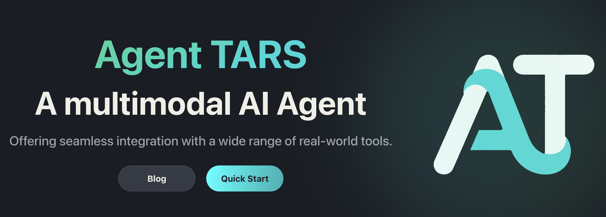

> [!WARNING]
> This document has been archived.

> [!IMPORTANT]
> <a href="../../apps/agent-tars/README.md">
>   
> </a>
>
> **\[2025-03-18\]** We released a **technical preview** version of a new desktop app - [Agent TARS](../../apps/agent-tars/README.md), a multimodal AI agent that leverages browser operations by visually interpreting web pages and seamlessly integrating with command lines and file systems.


<p align="center">
  
</p>

# UI-TARS Desktop

UI-TARS Desktop is a GUI Agent application based on [UI-TARS (Vision-Language Model)](https://github.com/bytedance/UI-TARS) that allows you to control your computer using natural language.


<p align="center">
        &nbsp&nbsp 📑 <a href="https://arxiv.org/abs/2501.12326">Paper</a> &nbsp&nbsp
        | 🤗 <a href="https://huggingface.co/bytedance-research/UI-TARS-7B-DPO">Hugging Face Models</a>&nbsp&nbsp
        | &nbsp&nbsp🫨 <a href="https://discord.gg/pTXwYVjfcs">Discord</a>&nbsp&nbsp
        | &nbsp&nbsp🤖 <a href="https://www.modelscope.cn/models/bytedance-research/UI-TARS-7B-DPO">ModelScope</a>&nbsp&nbsp
<br>
🖥️ Desktop Application &nbsp&nbsp
| &nbsp&nbsp 👓 <a href="https://github.com/web-infra-dev/midscene">Midscene (use in browser)</a>
</p>

## Showcases

| Instruction  | Video |
| :---:  | :---: |
| Get the current weather in SF using the web browser      |    <video src="https://github.com/user-attachments/assets/5235418c-ac61-4895-831d-68c1c749fc87" height="300" />    |
| Send a twitter with the content "hello world"   | <video src="https://github.com/user-attachments/assets/737ccc11-9124-4464-b4be-3514cbced85c" height="300" />        |


## News

- **\[2025-04-17\]** - 🎉 We're excited to announce support for **UI-TARS-1.5**, featuring enhanced performance, precise control, and expanded scenario coverage (using computer and browser as operators). Now compatible with multiple models: UI-TARS-1.0, UI-TARS-1.5, and Doubao-1.5-UI-TARS!
- **\[2025-02-20\]** - 📦 Introduced [UI TARS SDK](./sdk.md), is a powerful cross-platform toolkit for building GUI automation agents.
- **\[2025-01-23\]** - 🚀 We updated the **[Cloud Deployment](./deployment.md#cloud-deployment)** section in the 中文版: [GUI模型部署教程](https://bytedance.sg.larkoffice.com/docx/TCcudYwyIox5vyxiSDLlgIsTgWf#U94rdCxzBoJMLex38NPlHL21gNb) with new information related to the ModelScope platform. You can now use the ModelScope platform for deployment.


## Features

- 🤖 Natural language control powered by Vision-Language Model
- 🖥️ Screenshot and visual recognition support
- 🎯 Precise mouse and keyboard control
- 💻 Cross-platform support (Windows/MacOS)
- 🔄 Real-time feedback and status display
- 🔐 Private and secure - fully local processing

## Quick Start

See [Quick Start](./quick-start.md).

## Deployment

See [Deployment](./deployment.md).

## Contributing

See [CONTRIBUTING.md](./CONTRIBUTING.md).

## SDK (Experimental)

See [@ui-tars/sdk](./sdk.md)

## License

UI-TARS Desktop is licensed under the Apache License 2.0.

## Citation
If you find our paper and code useful in your research, please consider giving a star :star: and citation :pencil:

```BibTeX
@article{qin2025ui,
  title={UI-TARS: Pioneering Automated GUI Interaction with Native Agents},
  author={Qin, Yujia and Ye, Yining and Fang, Junjie and Wang, Haoming and Liang, Shihao and Tian, Shizuo and Zhang, Junda and Li, Jiahao and Li, Yunxin and Huang, Shijue and others},
  journal={arXiv preprint arXiv:2501.12326},
  year={2025}
}
```
