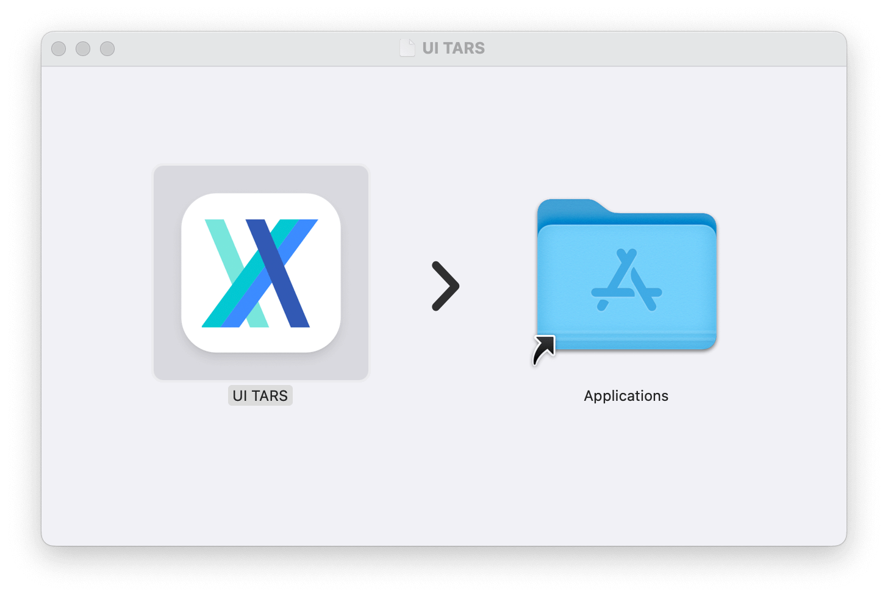
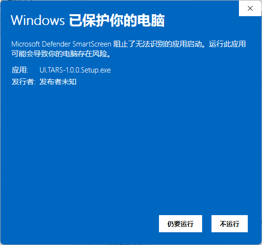

> [!WARNING]
> This document has been archived.

# Quick Start

## Download

You can download the [latest release](https://github.com/bytedance/UI-TARS-desktop/releases/latest) version of UI-TARS Desktop from our releases page.

> **Note**: If you have [Homebrew](https://brew.sh/) installed, you can install UI-TARS Desktop by running the following command:
> ```bash
> brew install --cask ui-tars
> ```

## Install

### MacOS

1. Drag **UI TARS** application into the **Applications** folder
  

2. Enable the permission of **UI TARS** in MacOS:
  - System Settings -> Privacy & Security -> **Accessibility**
  - System Settings -> Privacy & Security -> **Screen Recording**
  

3. Then open **UI TARS** application, you can see the following interface:
  


### Windows

**Still to run** the application, you can see the following interface:



