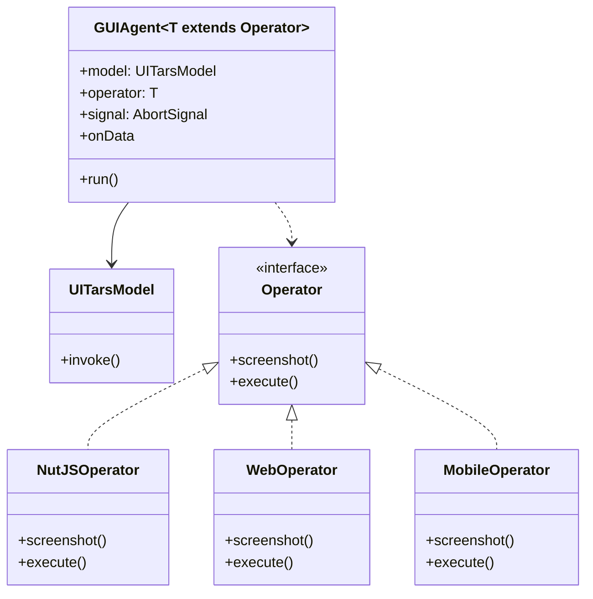
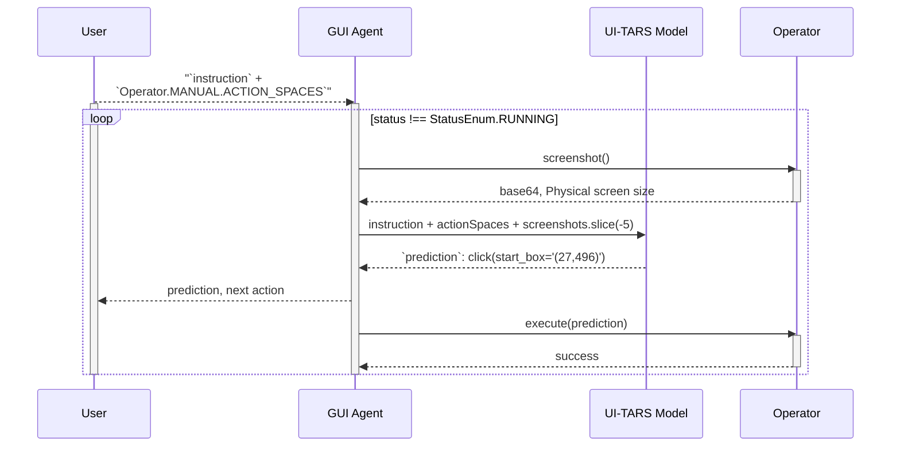
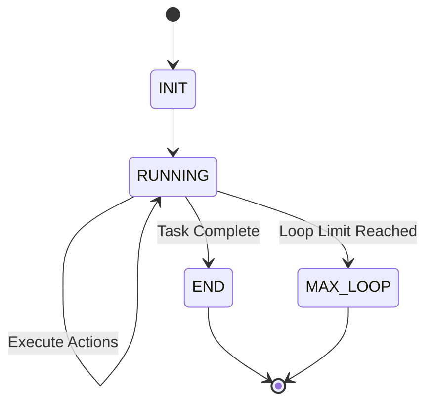

> [!WARNING]
> This document has been archived.

# @ui-tars/sdk Guide (Experimental)

## Overview

`@ui-tars/sdk` is a powerful cross-platform(ANY device/platform) toolkit for building GUI automation agents.

It provides a flexible framework to create agents that can interact with graphical user interfaces through various operators. It supports running on both **Node.js** and the **Web Browser**



## Try it out

```bash
npx @ui-tars/cli start
```

Input your UI-TARS Model Service Config(`baseURL`, `apiKey`, `model`), then you can control your computer with CLI.

```
Need to install the following packages:
Ok to proceed? (y) y

│
◆  Input your instruction
│  _ Open Chrome
└
```

## Agent Execution Process




### Basic Usage

Basic usage is largely derived from package `@ui-tars/sdk`, here's a basic example of using the SDK:

> Note: Using `nut-js`(cross-platform computer control tool) as the operator, you can also use or customize other operators. NutJS operator that supports common desktop automation actions:
> - Mouse actions: click, double click, right click, drag, hover
> - Keyboard input: typing, hotkeys
> - Scrolling
> - Screenshot capture

```ts
import { GUIAgent } from '@ui-tars/sdk';
import { NutJSOperator } from '@ui-tars/operator-nut-js';

const guiAgent = new GUIAgent({
  model: {
    baseURL: config.baseURL,
    apiKey: config.apiKey,
    model: config.model,
  },
  operator: new NutJSOperator(),
  onData: ({ data }) => {
    console.log(data)
  },
  onError: ({ data, error }) => {
    console.error(error, data);
  },
});

await guiAgent.run('send "hello world" to x.com');
```

### Handling Abort Signals

You can abort the agent by passing a `AbortSignal` to the GUIAgent `signal` option.

```ts
const abortController = new AbortController();

const guiAgent = new GUIAgent({
  // ... other config
  signal: abortController.signal,
});

// ctrl/cmd + c to cancel operation
process.on('SIGINT', () => {
  abortController.abort();
});
```

## Configuration Options

The `GUIAgent` constructor accepts the following configuration options:

- `model`: Model configuration(OpenAI-compatible API) or custom model instance
  - `baseURL`: API endpoint URL
  - `apiKey`: API authentication key
  - `model`: Model name to use
  - more options see [OpenAI API](https://platform.openai.com/docs/guides/vision/uploading-base-64-encoded-images)
- `operator`: Instance of an operator class that implements the required interface
- `signal`: AbortController signal for canceling operations
- `onData`: Callback for receiving agent data/status updates
  - `data.conversations` is an array of objects, **IMPORTANT: is delta, not the whole conversation history**, each object contains:
    - `from`: The role of the message, it can be one of the following:
      - `human`: Human message
      - `gpt`: Agent response
      - `screenshotBase64`: Screenshot base64
    - `value`: The content of the message
  - `data.status` is the current status of the agent, it can be one of the following:
    - `StatusEnum.INIT`: Initial state
    - `StatusEnum.RUNNING`: Agent is actively executing
    - `StatusEnum.END`: Operation completed
    - `StatusEnum.MAX_LOOP`: Maximum loop count reached
- `onError`: Callback for error handling
- `systemPrompt`: Optional custom system prompt
- `maxLoopCount`: Maximum number of interaction loops (default: 25)

### Status flow



## Advanced Usage

### Operator Interface

When implementing a custom operator, you need to implement two core methods: `screenshot()` and `execute()`.

#### Initialize

`npm init` to create a new operator package, configuration is as follows:

```json
{
  "name": "your-operator-tool",
  "version": "1.0.0",
  "main": "./dist/index.js",
  "module": "./dist/index.mjs",
  "types": "./dist/index.d.ts",
  "scripts": {
    "dev": "rslib build --watch",
    "prepare": "npm run build",
    "build": "rsbuild",
    "test": "vitest"
  },
  "files": [
    "dist"
  ],
  "publishConfig": {
    "access": "public",
    "registry": "https://registry.npmjs.org"
  },
  "dependencies": {
    "jimp": "^1.6.0"
  },
  "peerDependencies": {
    "@ui-tars/sdk": "^1.2.0-beta.17"
  },
  "devDependencies": {
    "@ui-tars/sdk": "^1.2.0-beta.17",
    "@rslib/core": "^0.5.4",
    "typescript": "^5.7.2",
    "vitest": "^3.0.2"
  }
}
```

#### screenshot()

This method captures the current screen state and returns a `ScreenshotOutput`:

```typescript
interface ScreenshotOutput {
  // Base64 encoded image string
  base64: string;
  // Device pixel ratio (DPR)
  scaleFactor: number;
}
```

#### execute()

This method performs actions based on model predictions. It receives an `ExecuteParams` object:

```typescript
interface ExecuteParams {
  /** Raw prediction string from the model */
  prediction: string;
  /** Parsed prediction object */
  parsedPrediction: {
    action_type: string;
    action_inputs: Record<string, any>;
    reflection: string | null;
    thought: string;
  };
  /** Device Physical Resolution */
  screenWidth: number;
  /** Device Physical Resolution */
  screenHeight: number;
  /** Device DPR */
  scaleFactor: number;
  /** model coordinates scaling factor [widthFactor, heightFactor] */
  factors: Factors;
}
```

Advanced sdk usage is largely derived from package `@ui-tars/sdk/core`, you can create custom operators by extending the base `Operator` class:

```typescript
import {
  Operator,
  type ScreenshotOutput,
  type ExecuteParams
  type ExecuteOutput,
} from '@ui-tars/sdk/core';
import { Jimp } from 'jimp';

export class CustomOperator extends Operator {
  // Define the action spaces and description for UI-TARS System Prompt splice
  static MANUAL = {
    ACTION_SPACES: [
      'click(start_box="") # click on the element at the specified coordinates',
      'type(content="") # type the specified content into the current input field',
      'scroll(direction="") # scroll the page in the specified direction',
      'finished() # finish the task',
      // ...more_actions
    ],
  };

  public async screenshot(): Promise<ScreenshotOutput> {
    // Implement screenshot functionality
    const base64 = 'base64-encoded-image';
    const buffer = Buffer.from(base64, 'base64');
    const image = await sharp(buffer).toBuffer();

    return {
      base64: 'base64-encoded-image',
      scaleFactor: 1
    };
  }

  async execute(params: ExecuteParams): Promise<ExecuteOutput> {
    const { parsedPrediction, screenWidth, screenHeight, scaleFactor } = params;
    // Implement action execution logic

    // if click action, get coordinates from parsedPrediction
    const [startX, startY] = parsedPrediction?.action_inputs?.start_coords || '';

    if (parsedPrediction?.action_type === 'finished') {
      // finish the GUIAgent task
      return { status: StatusEnum.END };
    }
  }
}
```

Required methods:
- `screenshot()`: Captures the current screen state
- `execute()`: Performs the requested action based on model predictions

Optional static properties:
- `MANUAL`: Define the action spaces and description for UI-TARS Model understanding
  - `ACTION_SPACES`: Define the action spaces and description for UI-TARS Model understanding

Loaded into `GUIAgent`:

```ts
const guiAgent = new GUIAgent({
  // ... other config
  systemPrompt: `
  // ... other system prompt
  ${CustomOperator.MANUAL.ACTION_SPACES.join('\n')}
  `,
  operator: new CustomOperator(),
});
```

### Custom Model Implementation

You can implement custom model logic by extending the `UITarsModel` class:

```typescript
class CustomUITarsModel extends UITarsModel {
  constructor(modelConfig: { model: string }) {
    super(modelConfig);
  }

  async invoke(params: any) {
    // Implement custom model logic
    return {
      prediction: 'action description',
      parsedPredictions: [{
        action_type: 'click',
        action_inputs: { /* ... */ },
        reflection: null,
        thought: 'reasoning'
      }]
    };
  }
}

const agent = new GUIAgent({
  model: new CustomUITarsModel({ model: 'custom-model' }),
  // ... other config
});
```

> Note: However, it is not recommended to implement a custom model because it contains a lot of data processing logic (including image transformations, scaling factors, etc.).

### Planning

You can combine planning/reasoning models (such as OpenAI-o1, DeepSeek-R1) to implement complex GUIAgent logic for planning, reasoning, and execution:

```ts
const guiAgent = new GUIAgent({
  // ... other config
});

const planningList = await reasoningModel.invoke({
  conversations: [
    {
      role: 'user',
      content: 'buy a ticket from beijing to shanghai',
    }
  ]
})
/**
 * [
 *  'open chrome',
 *  'open trip.com',
 *  'click "search" button',
 *  'select "beijing" in "from" input',
 *  'select "shanghai" in "to" input',
 *  'click "search" button',
 * ]
 */

for (const planning of planningList) {
  await guiAgent.run(planning);
}
```


