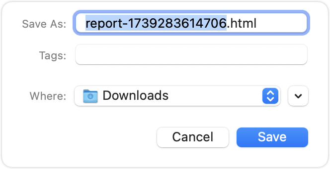

> [!WARNING]
> This document has been archived.

# Settings Configuration Guide

## Overview

**UI-TARS Desktop** offers granular control over application behavior through its settings system. This document provides comprehensive guidance on configuration options, preset management, and operational best practices.

<p align="center">
  
  <br>
  <em>Main Settings Interface</em>
</p>


<br>


## Configuration Options

### Language

Controls localization settings for VLM.

| Property    | Details                        |
| ----------- | ------------------------------ |
| **Type**    | `string`                       |
| **Options** | `en` (English), `zh` (Chinese) |
| **Default** | `en`                           |

> [!NOTE]
> Changing the settings will **only** affect the output of VLM, not the language of the desktop app itself. Regarding the i18n of the App itself, welcome to contribute PR.


<br>


### VLM Base URL

Specify the base url of the VLM that needs to be requested.

For UI TARS deployment, please check out [Deployment](./deployment.md).

| Property     | Details  |
| ------------ | -------- |
| **Type**     | `string` |
| **Required** | `true`   |

> [!NOTE]
> VLM Base URL should be OpenAI compatible API endpoints (see [OpenAI API protocol document](https://platform.openai.com/docs/guides/vision/uploading-base-64-encoded-images) for more details).


<br>


### VLM Model Name

Specify the requested module name.

| Property     | Details  |
| ------------ | -------- |
| **Type**     | `string` |
| **Required** | `true`   |


<br>


### VLM Provider

Selects the backend VLM provider for make GUI action decisions.

| Property    | Details                |
| ----------- | ---------------------- |
| **Type**    | `string`               |
| **Options** | `Hugging Face`, `vLLM` |
| **Default** | `Hugging Face`         |

> [!NOTE]
> This is an interface reserved for different VLM providers.


<br>


### Report Storage Base URL

Defines the base URL for uploading report file. By default, when this option is not set, when the user clicks **Export as HTML** (a.k.a. <b>Share</b>), it will automatically trigger the download of the report file:

<p align="center">
  
  <br>
</p>

Once it's set, when user click **Export as HTML**, report file will firstly be uploaded to the Report Storage Server, which returns a publicly accessible URL for the persistent file.

<p align="center">
  
  <br>
</p>

#### Report Storage Server Interface

The Report Storage Server should implement the following HTTP API endpoint:

| Property     | Details                                                                                                      |
| ------------ | ------------------------------------------------------------------------------------------------------------ |
| **Endpoint** | `POST /your-storage-enpoint`                                                                                 |
| **Headers**  | Content-Type: `multipart/form-data` <br> <!-- - Authorization: Bearer \<access_token\> (Not Supported) --> |

#### Request Body

The request should be sent as `multipart/form-data` with the following field:

| Field | Type | Required | Description      | Constraints                        |
| ----- | ---- | -------- | ---------------- | ---------------------------------- |
| file  | File | Yes      | HTML report file | - Format: HTML<br>- Max size: 30MB |

#### Response

**Success Response (200 OK)**
```json
{
  "url": "https://example.com/reports/xxx.html"
}
```

The response should return a JSON object containing a publicly accessible URL where the report can be accessed.

> [!NOTE]
> Currently, there is no authentication designed for Report Storage Server. If you have any requirements, please submit an [issue](https://github.com/bytedance/UI-TARS-desktop/issues).


<br>


### UTIO Base URL

**UTIO** (_UI-TARS Insights and Observation_) is a data collection mechanism for insights into **UI-TARS Desktop** (_Introduced at [#60](https://github.com/bytedance/UI-TARS-desktop/pull/60)_). The design of UTIO is also related to sharing. The overall process is as follows:

<p align="center">
  
  <br>
  <em>UTIO Flow</em>
</p>

This option defines the base URL for the **UTIO** server that handles application events and instructions.


#### Server Interface Specification

The UTIO server accepts events through HTTP POST requests and supports three types of events:

| Property     | Details                          |
| ------------ | -------------------------------- |
| **Endpoint** | `POST /your-utio-endpoint`       |
| **Headers**  | Content-Type: `application/json` |

##### Event Types

The server handles three types of events:

###### **Application Launch**
```typescript
interface AppLaunchedEvent {
  type: 'appLaunched';
  /** Platform type */
  platform: string;
  /** OS version, e.g. "major.minor.patch" format */
  osVersion: string;
  /** Screen width in pixels */
  screenWidth: number;
  /** Screen height in pixels */
  screenHeight: number;
}
```

###### **Send Instruction**
```typescript
interface SendInstructionEvent {
  type: 'sendInstruction';
  /** User-submitted instruction content */
  instruction: string;
}
```

###### **Share Report**
```typescript
interface ShareReportEvent {
  type: 'shareReport';
  /** Optional last screenshot url or base64 content */
  lastScreenshot?: string;
  /** Optional report url */
  report?: string;
  /** Related instruction */
  instruction: string;
}
```

##### Request Example

```json
{
  "type": "appLaunched",
  "platform": "iOS",
  "osVersion": "16.0.0",
  "screenWidth": 390,
  "screenHeight": 844
}
```

##### Response

**Success Response (200 OK)**
```json
{
  "success": true
}
```

> [!NOTE]
> All events are processed asynchronously. The server should respond promptly to acknowledge receipt of the event.


##### Server Example

###### Node.js

```js
const express = require('express');
const cors = require('cors');
const app = express();
const port = 3000;

app.use(cors());
app.use(express.json());

app.post('/your-utio-endpoint', (req, res) => {
  const event = req.body;
  
  if (!event || !event.type) {
    return res.status(400).json({ error: 'Missing event type' });
  }

  switch (event.type) {
    case 'appLaunched':
      return handleAppLaunch(event, res);
    case 'sendInstruction':
      return handleSendInstruction(event, res);
    case 'shareReport':
      return handleShareReport(event, res);
    default:
      return res.status(400).json({ error: 'Unsupported event type' });
  }
});

app.listen(port, () => {
  console.log(`Server listening on port ${port}`);
});
```

###### Python

```python
from flask import Flask, request, jsonify
from flask_cors import CORS
import re

app = Flask(__name__)
CORS(app)

@app.route('/events', methods=['POST'])
def handle_event():
    data = request.get_json()
    
    if not data or 'type' not in data:
        return jsonify({'error': 'Missing event type'}), 400
    
    event_type = data['type']
    
    if event_type == 'appLaunched':
        return handle_app_launch(data)
    elif event_type == 'sendInstruction':
        return handle_send_instruction(data)
    elif event_type == 'shareReport':
        return handle_share_report(data)
    else:
        return jsonify({'error': 'Unsupported event type'}), 400

if __name__ == '__main__':
    app.run(port=3000)
```

