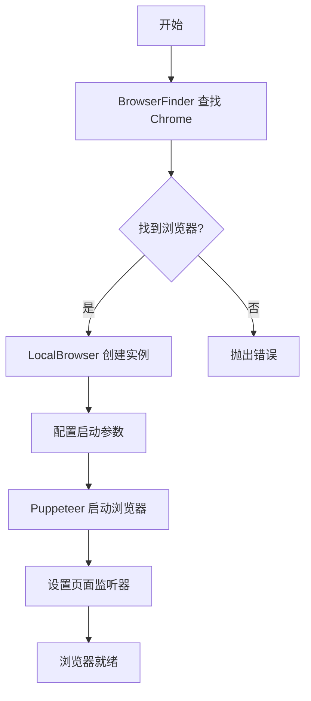
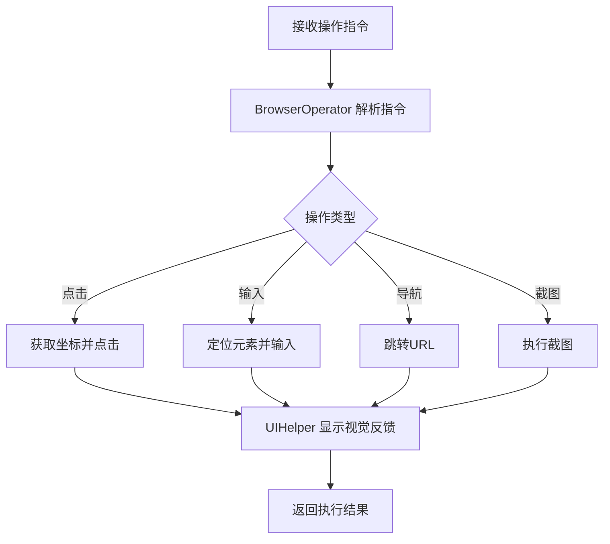
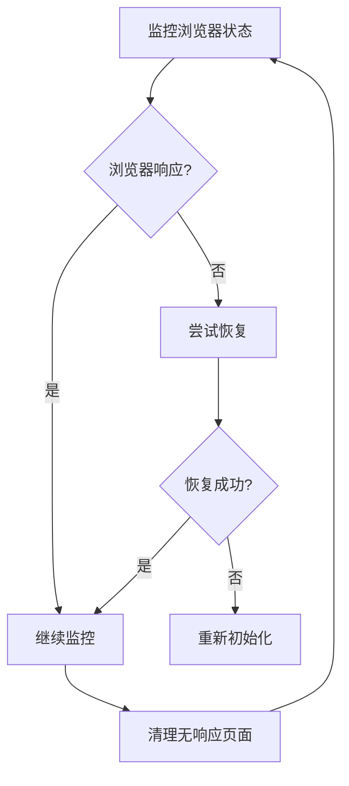

# UI-TARS-Desktop Chrome 浏览器集成详解

本文档详细介绍了 UI-TARS-Desktop 如何查找、启动和控制本地 Chrome 浏览器的完整流程。

## 目录

1. [概述](#概述)
2. [核心架构](#核心架构)
   - [浏览器查找机制](#浏览器查找机制)
   - [浏览器启动过程](#浏览器启动过程)
   - [浏览器操作接口](#浏览器操作接口)
   - [MCP Server 管理](#mcp-server-管理)
3. [技术实现](#技术实现)
   - [完整调用流程](#完整调用流程)
   - [Chrome DevTools Protocol (CDP) 详解](#chrome-devtools-protocol-cdp-详解)
4. [技术选型](#技术选型)
   - [Puppeteer Core vs Playwright 对比](#puppeteer-core-vs-playwright-对比)
5. [高级配置](#高级配置)
   - [复用本地 Chrome Profile 和 Cookie](#复用本地-chrome-profile-和-cookie)
6. [最佳实践](#最佳实践)
7. [总结](#总结)

## 概述

UI-TARS-Desktop 使用 Puppeteer Core 作为底层浏览器控制库，实现了从浏览器路径查找到高级操作的完整解决方案。整个系统分为四个核心模块：

- **browser-finder**: 负责在不同操作系统中查找 Chrome 浏览器
- **local-browser**: 负责启动和管理本地浏览器实例
- **browser-operator**: 提供高级浏览器操作接口
- **mcp-server/browser**: 提供 MCP 协议的浏览器服务

## 核心架构

### 浏览器查找机制

#### 文件位置
`packages/agent-infra/browser/src/browser-finder/chrome-paths.ts`

#### 查找策略

##### macOS
```typescript
// 查找路径
const prefixes = ['', process.env.HOME];
const suffix = `/Applications/${name}.app/Contents/MacOS/${name}`;

// 支持的浏览器版本
- Google Chrome
- Google Chrome Beta
- Google Chrome Dev
- Google Chrome Canary
```

##### Windows
```typescript
// 查找路径
const prefixes = [
  process.env.LOCALAPPDATA,
  process.env.PROGRAMFILES,
  process.env['PROGRAMFILES(X86)']
];
const suffix = `\\Google\\${name}\\Application\\chrome.exe`;

// 支持的浏览器版本
- Chrome
- Chrome Beta
- Chrome Dev
- Chrome SxS (Canary)
```

##### Linux
```typescript
// 使用 which 命令查找
const browsers = [
  'google-chrome-stable',
  'google-chrome',
  'google-chrome-beta',
  'google-chrome-dev',
  'chromium-browser',
  'chromium'
];
```

#### 优先级顺序
1. Chrome (稳定版)
2. Chrome Beta
3. Chrome Dev
4. Chrome Canary

#### 性能优化
- 避免使用耗时的 `lsregister -dump` 命令（macOS）
- 使用文件系统检查代替执行外部命令
- 缓存查找结果避免重复查找

### 浏览器启动过程

#### 文件位置
`packages/agent-infra/browser/src/local-browser.ts`

#### 启动配置

##### 基础配置
```typescript
{
  browser: type,              // 'chrome' | 'firefox'
  executablePath: path,       // 浏览器可执行文件路径
  headless: false,           // 默认显示界面
  defaultViewport: {
    width: 1280,             // 默认宽度
    height: 800,             // 默认高度
    deviceScaleFactor: 0     // 使用系统默认缩放
  }
}
```

##### 启动参数
```bash
--no-sandbox                              # 禁用沙盒模式
--mute-audio                              # 静音
--disable-gpu                             # 禁用GPU加速
--disable-http2                           # 禁用HTTP/2
--disable-blink-features=AutomationControlled  # 隐藏自动化特征
--disable-infobars                        # 禁用信息栏
--disable-background-timer-throttling     # 禁用后台定时器限制
--disable-popup-blocking                  # 禁用弹窗拦截
--disable-backgrounding-occluded-windows  # 禁用窗口遮挡时的后台处理
--disable-renderer-backgrounding          # 禁用渲染器后台处理
--disable-window-activation               # 禁用窗口激活
--disable-focus-on-load                   # 禁用加载时聚焦
--no-default-browser-check                # 禁用默认浏览器检查
--disable-web-security                    # 禁用CORS（跨域资源共享）
--disable-features=IsolateOrigins,site-per-process  # 禁用站点隔离
--disable-site-isolation-trials           # 禁用站点隔离试验
--window-size=${width},${height}          # 设置窗口大小
```

#### 页面监听器

启动后会设置页面事件监听器：

```typescript
// 监听页面创建
browser.on('targetcreated', async (target) => {
  if (target.type() === 'page') {
    const page = await target.page();
    this.activePage = page;
  }
});

// 监听页面切换
browser.on('targetchanged', async (target) => {
  const page = await target.page();
  if (page && page.url() !== 'about:blank') {
    this.activePage = page;
  }
});

// 监听页面关闭
browser.on('targetdestroyed', async (target) => {
  if (target.type() === 'page') {
    this.activePage = null;
  }
});
```

### 浏览器操作接口

#### 文件位置
`packages/ui-tars/operators/browser-operator/src/browser-operator.ts`

#### 核心功能

##### 1. 截图功能
```typescript
screenshot(): Promise<ScreenshotOutput>
```
- 支持高亮可点击元素
- 支持水流动画效果
- 返回 base64 编码的图片数据
- 自动获取设备缩放比例

##### 2. 鼠标操作
```typescript
// 单击
handleClick(x: number, y: number)

// 双击
handleDoubleClick(x: number, y: number)

// 右击
handleRightClick(x: number, y: number)

// 拖拽
handleDrag(startX, startY, endX, endY)
```

##### 3. 键盘操作
```typescript
// 输入文本
handleType(content: string)

// 快捷键
handleHotkey(keys: string)  // 如 "ctrl+c"

// 按下/释放按键
handlePress(key: string)
handleRelease(key: string)
```

##### 4. 导航操作
```typescript
// 跳转URL
handleNavigate(url: string)

// 后退
handleNavigateBack()
```

##### 5. 滚动操作
```typescript
handleScroll(direction: 'up' | 'down', amount: number)
```

#### 视觉辅助

UIHelper 类提供视觉反馈功能：
- 点击指示器：显示点击位置
- 元素高亮：高亮可交互元素
- 水流效果：截图时的视觉效果
- 操作信息：显示当前执行的操作

### MCP Server 管理

#### 文件位置
`packages/agent-infra/mcp-servers/browser/src/server.ts`

#### 核心工具

##### 1. 页面管理
- `browser_screenshot`: 截图
- `browser_new_tab`: 新建标签
- `browser_close_tab`: 关闭标签
- `browser_switch_tab`: 切换标签
- `browser_tab_list`: 获取标签列表

##### 2. DOM 操作
- `browser_click`: 点击元素
- `browser_form_input_fill`: 填充表单
- `browser_select`: 选择下拉框
- `browser_hover`: 悬停元素
- `browser_get_clickable_elements`: 获取可点击元素

##### 3. 内容获取
- `browser_get_text`: 获取文本内容
- `browser_get_markdown`: 获取 Markdown 格式内容
- `browser_read_links`: 获取所有链接

##### 4. 页面控制
- `browser_evaluate`: 执行 JavaScript
- `browser_scroll`: 滚动页面
- `browser_press_key`: 按键操作

#### 浏览器健康检查

```typescript
async getCurrentPage(browser: Browser) {
  // 检查页面是否可见
  const isVisible = await page.evaluate(
    () => document.visibilityState === 'visible'
  );
  
  // 检查页面是否响应
  const isHealthy = await page.evaluate(() => 1 + 1)
    .then(r => r === 2);
  
  // 优先级：可见页面 > 健康页面 > 响应页面
}
```

#### 下载管理

```typescript
// 设置下载行为
await client.send('Browser.setDownloadBehavior', {
  behavior: 'allow',
  downloadPath: outputDir,
  eventsEnabled: true
});

// 监听下载事件
client.on('Browser.downloadWillBegin', (event) => {
  // 记录下载信息
});

client.on('Browser.downloadProgress', (event) => {
  // 更新下载进度
});
```

## 技术实现

### 完整调用流程

#### 1. 初始化阶段



#### 2. 操作执行阶段



#### 3. 资源管理阶段



## 最佳实践

### 性能优化
- 复用浏览器实例，避免频繁启动
- 及时清理无用的页面和标签
- 使用页面池管理多个页面

### 错误处理
- 实现重试机制处理临时性错误
- 监控页面健康状态，及时恢复
- 记录详细日志便于问题排查

### 安全考虑
- 禁用不必要的浏览器特性
- 使用代理时注意认证信息安全
- 限制 JavaScript 执行权限

### 兼容性
- 支持多种 Chrome 版本和变体
- 兼容不同操作系统的路径差异
- 处理不同设备的缩放比例

## 技术选型

### Puppeteer Core vs Playwright 对比

#### 技术选型背景

UI-TARS-Desktop 项目使用 Puppeteer Core（版本 24.7.2）作为浏览器自动化解决方案。虽然项目中也包含 Playwright 配置文件（用于 E2E 测试），但核心的浏览器控制功能是基于 Puppeteer Core 实现的。

#### Puppeteer Core 优势

##### 1. 轻量级部署
- **不捆绑浏览器**：作为 Electron 应用，可以直接使用用户系统已安装的 Chrome
- **体积优势**：避免打包浏览器二进制文件，显著减少应用体积
- **灵活性**：用户可以使用自己偏好的 Chrome 版本

##### 2. Chrome 生态深度集成
- **官方支持**：Google 官方维护，与 Chrome DevTools Protocol 深度集成
- **特性同步**：Chrome 新特性支持更快更完整
- **稳定性**：与 Chrome/Chromium 的兼容性最佳

##### 3. 成熟的生态系统
- **社区庞大**：问题解决方案丰富，文档完善
- **API 稳定**：Breaking changes 较少，升级成本低
- **工具链完整**：丰富的第三方工具和插件支持

##### 4. 性能表现
- **启动速度快**：直接连接已安装的浏览器，无需解压和初始化
- **内存占用低**：不需要管理多个浏览器实例
- **CDP 直连**：通过 Chrome DevTools Protocol 直接通信，性能开销小

#### Puppeteer Core 局限性

##### 1. 浏览器支持有限
- 主要支持 Chrome/Chromium 系列
- Firefox 支持处于实验阶段，功能不完整
- 不支持 Safari/WebKit

##### 2. 跨浏览器测试
- 需要额外工具处理不同浏览器的兼容性
- 移动端浏览器模拟支持有限
- 无法进行真正的跨浏览器测试

##### 3. API 相对底层
- 需要手动处理更多实现细节
- 自动等待机制不如 Playwright 智能
- 错误处理需要更多手动代码

#### Playwright 优势

##### 1. 多浏览器原生支持
- **全平台覆盖**：原生支持 Chromium、Firefox、WebKit
- **一致的 API**：同一套代码可以在所有浏览器上运行
- **移动端模拟**：更完善的移动设备模拟能力

##### 2. 现代化的 API 设计
- **自动等待**：智能等待元素可交互状态
- **网络拦截**：更强大的网络请求拦截和修改能力
- **重试机制**：内置的断言和重试机制

##### 3. 强大的测试功能
- **内置测试运行器**：无需额外配置测试框架
- **并行执行**：原生支持并行测试执行
- **调试工具**：视频录制、追踪、时间旅行调试等

##### 4. 更好的开发体验
- **TypeScript 优先**：完整的类型支持
- **Context 隔离**：更好的测试隔离和并发支持
- **选择器引擎**：更强大的元素选择能力

#### Playwright 局限性

##### 1. 资源占用
- **体积较大**：默认下载所有浏览器二进制文件
- **磁盘占用**：即使只用一个浏览器也会占用大量空间
- **初始化慢**：首次运行需要下载和解压浏览器

##### 2. 生态系统
- **相对较新**：社区规模小于 Puppeteer
- **第三方支持**：工具和插件生态相对较少
- **迁移成本**：从其他工具迁移需要重写代码

##### 3. 复杂性
- **学习曲线**：更多的概念和 API
- **配置复杂**：需要理解 Context、Page、Frame 等概念
- **过度设计**：对于简单场景可能过于复杂

#### 在 UI-TARS-Desktop 中的选择理由

##### 选择 Puppeteer Core 的关键因素

1. **桌面应用场景**
   - 作为 Electron 应用，不需要跨浏览器测试
   - 用户使用自己的 Chrome，提供更好的体验
   - 避免打包多个浏览器增加下载和安装负担

2. **性能考虑**
   - UI 自动化需要快速响应
   - Puppeteer Core 启动更快，资源占用更少
   - 直接使用系统浏览器，无需额外初始化

3. **技术需求匹配**
   - 项目主要操作 Chrome，不需要多浏览器支持
   - API 简单直接，满足项目的自动化需求
   - 与 Chrome 的深度集成符合项目定位

4. **维护成本**
   - 团队熟悉 Puppeteer 生态
   - 社区支持成熟，问题解决方案多
   - 升级和维护成本相对较低

#### 选型建议

##### 适合使用 Puppeteer Core 的场景
- **桌面应用开发**：特别是 Electron 应用
- **Chrome 专属功能**：需要使用 Chrome 特有功能
- **性能敏感**：对启动速度和资源占用有要求
- **简单自动化**：不需要复杂的测试功能

##### 适合使用 Playwright 的场景
- **Web 应用测试**：需要完整的 E2E 测试能力
- **跨浏览器兼容**：必须支持多种浏览器
- **CI/CD 集成**：需要在自动化流程中运行
- **复杂测试场景**：需要并行、录制、调试等高级功能

#### 迁移考虑

如果未来需要从 Puppeteer Core 迁移到 Playwright：

1. **API 相似性**：基础 API 概念相似，迁移相对容易
2. **渐进式迁移**：可以先在测试中使用 Playwright
3. **混合使用**：可以在不同模块中使用不同的工具
4. **评估必要性**：需要权衡迁移成本和收益

## 总结

UI-TARS-Desktop 的浏览器集成方案具有以下特点：

1. **智能查找**：自动检测系统中安装的 Chrome 浏览器
2. **灵活配置**：支持丰富的启动参数和运行时配置
3. **稳定可靠**：完善的错误处理和恢复机制
4. **功能丰富**：提供从基础操作到高级功能的完整接口
5. **视觉友好**：内置视觉反馈机制，操作过程清晰可见

选择 Puppeteer Core 作为浏览器自动化方案是基于项目特点的合理决策。它在桌面应用场景下提供了最佳的性能和用户体验平衡，同时保持了代码的简洁和可维护性。

### Chrome DevTools Protocol (CDP) 详解

#### 什么是 CDP

Chrome DevTools Protocol（CDP）是 Chrome 浏览器提供的一套用于与浏览器进行程序化交互的协议。它是 Chrome 开发者工具的底层通信协议，允许工具通过 WebSocket 连接来检查、调试和控制 Chrome 浏览器或其他基于 Blink 的浏览器。

##### CDP 的核心特点

1. **基于 WebSocket 的双向通信**
   ```javascript
   // CDP 连接示例
   const CDP = require('chrome-remote-interface');
   
   CDP(async (client) => {
     const {Network, Page} = client;
     
     // 监听网络事件
     Network.requestWillBeSent((params) => {
       console.log('Request:', params.request.url);
     });
     
     await Network.enable();
     await Page.enable();
     await Page.navigate({url: 'https://example.com'});
   });
   ```

2. **领域划分的 API 结构**
   - **Page**：页面导航、截图、PDF 生成等
   - **Network**：网络请求拦截、响应修改等
   - **Runtime**：JavaScript 执行、对象操作等
   - **DOM**：DOM 树操作、元素查询等
   - **Input**：模拟键盘、鼠标、触摸事件等

3. **事件驱动模型**
   - 客户端发送命令（Command）
   - 浏览器返回响应（Response）
   - 浏览器主动推送事件（Event）

#### 为什么 CDP 性能开销低

##### 1. 直接通信 vs 中间层
```
传统方式（如 Selenium）：
客户端 -> WebDriver -> HTTP Server -> 浏览器驱动 -> 浏览器

CDP 方式（Puppeteer）：
客户端 -> WebSocket -> 浏览器
```

##### 2. 协议效率对比

**WebDriver 协议（Selenium 使用）**：
- 基于 HTTP REST API
- 每个操作都是独立的 HTTP 请求
- 需要序列化/反序列化 JSON
- 有网络往返延迟

**CDP 协议（Puppeteer 使用）**：
- 基于 WebSocket 长连接
- 双向实时通信
- 更少的握手开销
- 支持并发命令

##### 3. 具体性能差异

```javascript
// Selenium 方式（伪代码）
// 每个操作都是一次 HTTP 请求
await driver.get('https://example.com');          // HTTP 请求 1
const element = await driver.findElement(By.id('button')); // HTTP 请求 2  
await element.click();                             // HTTP 请求 3

// Puppeteer CDP 方式
// 通过 WebSocket 发送命令，延迟更低
await page.goto('https://example.com');           // WebSocket 消息 1
await page.click('#button');                      // WebSocket 消息 2
```

##### 4. 性能优势体现

1. **启动速度**
   - Selenium：需要启动 WebDriver 服务器（如 ChromeDriver）
   - Puppeteer：直接连接浏览器的调试端口

2. **命令执行**
   - Selenium：每个命令约 10-50ms 开销（HTTP 往返）
   - Puppeteer：每个命令约 1-5ms 开销（WebSocket 消息）

3. **并发操作**
   ```javascript
   // Puppeteer 可以并发执行多个操作
   await Promise.all([
     page.waitForNavigation(),
     page.click('button')
   ]);
   
   // Selenium 必须串行执行
   driver.findElement(By.tagName('button')).click();
   driver.wait(until.urlContains('newpage'));
   ```

4. **事件监听**
   ```javascript
   // CDP 可以实时监听浏览器事件
   page.on('request', request => {
     console.log('Request:', request.url());
   });
   
   // Selenium 需要轮询或使用代理
   ```

#### CDP 在 UI-TARS-Desktop 中的应用

在项目中，CDP 的使用体现在多个方面：

1. **页面生命周期管理**
   ```typescript
   // packages/agent-infra/browser/src/base-browser.ts
   browser.on('targetcreated', async (target) => {
     // CDP 事件：新页面创建
   });
   ```

2. **下载管理**
   ```typescript
   // packages/agent-infra/mcp-servers/browser/src/utils/browser.ts
   const client = await page.createCDPSession();
   await client.send('Browser.setDownloadBehavior', {
     behavior: 'allow',
     downloadPath: outputDir
   });
   ```

3. **性能优化**
   - 使用 CDP 的原生截图功能，而不是通过 JavaScript 实现
   - 直接监听网络事件，无需额外的代理服务器
   - 利用 CDP 的页面冻结功能，优化多标签页性能

#### 性能对比总结

| 特性 | WebDriver/Selenium | CDP/Puppeteer | 性能差异 |
|------|-------------------|---------------|----------|
| 连接方式 | HTTP REST | WebSocket | CDP 快 5-10x |
| 启动时间 | 2-5 秒 | 0.5-1 秒 | CDP 快 4-5x |
| 命令延迟 | 10-50ms | 1-5ms | CDP 快 10x |
| 并发支持 | 有限 | 原生支持 | CDP 更高效 |
| 事件监听 | 轮询 | 实时推送 | CDP 无延迟 |
| 内存占用 | 额外进程 | 共享进程 | CDP 更少 |

这就是为什么 UI-TARS-Desktop 选择基于 CDP 的 Puppeteer Core，它在性能关键的 UI 自动化场景中提供了显著的优势。

## 高级配置

### 复用本地 Chrome Profile 和 Cookie

#### 问题背景

默认情况下，UI-TARS-Desktop 启动的是一个全新的 Chrome 实例，不包含用户的登录状态、Cookie、扩展等数据。这对于需要访问已登录网站的场景来说不够便利。

#### Chrome 用户数据目录位置

不同操作系统的 Chrome 用户数据存储位置：

- **macOS**: `~/Library/Application Support/Google/Chrome`
- **Windows**: `%LOCALAPPDATA%\Google\Chrome\User Data`
- **Linux**: `~/.config/google-chrome`

#### 当前实现分析

根据代码分析，UI-TARS-Desktop 支持通过 `userDataDir` 和 `profilePath` 参数来指定 Chrome 用户数据：

```typescript
// packages/agent-infra/browser/src/types.ts
export interface LaunchOptions {
  /**
   * Path to a user data directory.
   */
  userDataDir?: string;
  
  /**
   * Path to a specific browser profile to use
   */
  profilePath?: string;
}
```

但在实际启动时（`DefaultBrowserOperator.getInstance`），并没有传递这些参数。

#### 解决方案

##### 方案一：修改代码使用本地用户数据（推荐）

修改 `packages/ui-tars/operators/browser-operator/src/browser-operator.ts`：

```typescript
public static async getInstance(
  highlight = false,
  showActionInfo = false,
  showWaterFlow = false,
  isCallUser = false,
  searchEngine = 'google' as SearchEngine,
): Promise<DefaultBrowserOperator> {
  if (!this.logger) {
    this.logger = new ConsoleLogger('[DefaultBrowserOperator]');
  }

  if (this.browser) {
    const isAlive = await this.browser.isBrowserAlive();
    if (!isAlive) {
      this.browser = null;
      this.instance = null;
    }
  }

  if (!this.browser) {
    // 获取 Chrome 用户数据目录
    const userDataDir = process.platform === 'darwin' 
      ? `${process.env.HOME}/Library/Application Support/Google/Chrome`
      : process.platform === 'win32'
      ? `${process.env.LOCALAPPDATA}\\Google\\Chrome\\User Data`
      : `${process.env.HOME}/.config/google-chrome`;
    
    this.browser = new LocalBrowser({ logger: this.logger });
    await this.browser.launch({
      executablePath: this.browserPath,
      browserType: this.browserType,
      userDataDir: userDataDir,  // 添加用户数据目录
      // profilePath: 'Default',  // 可选：指定特定的 Profile
    });
  }
  
  // ... 其余代码保持不变 ...
}
```

##### 方案二：连接到已运行的 Chrome 实例

如果不想让 UI-TARS-Desktop 独占 Chrome，可以连接到已经运行的 Chrome 实例：

1. **启动 Chrome 时开启调试端口**：

```bash
# macOS
/Applications/Google\ Chrome.app/Contents/MacOS/Google\ Chrome \
  --remote-debugging-port=9222 \
  --user-data-dir="$HOME/Library/Application Support/Google/Chrome"

# Windows
chrome.exe --remote-debugging-port=9222

# Linux
google-chrome --remote-debugging-port=9222
```

2. **使用 RemoteBrowser 连接**：

```typescript
// 使用 RemoteBrowserOperator 而不是 DefaultBrowserOperator
const operator = await RemoteBrowserOperator.getInstance(
  'ws://localhost:9222',  // 连接到调试端口
  highlight,
  showActionInfo,
  showWaterFlow,
  isCallUser
);
```

##### 方案三：创建专用 Profile（最安全）

为 UI-TARS-Desktop 创建一个独立的 Chrome Profile，既能保持隔离又能手动登录需要的网站。

**重要说明**：这个方案实际上**不是共享**本地 Chrome 数据，而是创建一个**完全独立**的 Chrome Profile。

###### 什么是 Chrome Profile

Chrome Profile 是浏览器用来存储用户数据的独立空间，包括：
- Cookie 和登录状态
- 浏览历史和书签
- 已安装的扩展程序
- 保存的密码
- 个人设置和偏好

###### 基本实现

```typescript
// 使用专用的用户数据目录
const uitarsUserDataDir = process.platform === 'darwin'
  ? `${process.env.HOME}/Library/Application Support/Google/Chrome-UITARS`
  : process.platform === 'win32'
  ? `${process.env.LOCALAPPDATA}\\Google\\Chrome-UITARS`
  : `${process.env.HOME}/.config/google-chrome-uitars`;

await this.browser.launch({
  executablePath: this.browserPath,
  browserType: this.browserType,
  userDataDir: uitarsUserDataDir,
});
```

###### 完整的 Profile 管理实现

```typescript
class UITARSBrowserManager {
  private static UITARS_PROFILE_PATH = this.getProfilePath();
  
  private static getProfilePath() {
    const baseDir = process.platform === 'darwin'
      ? `${process.env.HOME}/Library/Application Support`
      : process.platform === 'win32'
      ? process.env.LOCALAPPDATA
      : `${process.env.HOME}/.config`;
      
    return path.join(baseDir, 'Google/Chrome-UITARS');
  }
  
  // 初始化专用 Profile
  static async initializeProfile() {
    // 检查 Profile 是否已存在
    if (!fs.existsSync(this.UITARS_PROFILE_PATH)) {
      console.log('Creating new UI-TARS Chrome Profile...');
      
      // 可选：从主 Profile 复制某些非敏感数据
      await this.copySelectedData();
    }
    
    return this.UITARS_PROFILE_PATH;
  }
  
  // 选择性复制数据（可选）
  static async copySelectedData() {
    const mainProfilePath = this.getMainProfilePath();
    
    // 复制书签（如果需要）
    const bookmarksFile = path.join(mainProfilePath, 'Default/Bookmarks');
    if (fs.existsSync(bookmarksFile)) {
      const targetPath = path.join(this.UITARS_PROFILE_PATH, 'Default');
      fs.mkdirSync(targetPath, { recursive: true });
      fs.copyFileSync(bookmarksFile, path.join(targetPath, 'Bookmarks'));
    }
    
    // 注意：不建议直接复制 Cookies 文件，因为可能包含敏感信息
  }
  
  // 提供初始化向导
  static async setupWizard() {
    console.log('Setting up UI-TARS Browser Profile...');
    
    // 创建 Profile
    const profilePath = await this.createProfile();
    
    // 启动浏览器让用户登录必要的网站
    const browser = await puppeteer.launch({
      executablePath: await this.findChrome(),
      userDataDir: profilePath,
      headless: false,
      args: ['--no-first-run', '--no-default-browser-check']
    });
    
    const page = await browser.newPage();
    await page.goto('chrome://newtab');
    
    console.log('Please login to the websites you need.');
    console.log('Close the browser when done.');
    
    // 等待用户完成设置
    await browser.on('disconnected', () => {
      console.log('Profile setup complete!');
    });
  }
}
```

###### 如何实现数据"共享"

虽然是独立的 Profile，但可以通过以下方式实现部分数据的共享：

1. **手动登录（推荐）**
   - 首次使用时手动登录需要的网站
   - Chrome 会将登录状态保存在专用 Profile 中
   - 后续使用时自动保持登录状态

2. **导入特定 Cookie**
   
   这个方法需要运行两个独立的 Chrome 实例来转移 Cookie。以下是完整的实现：

   ```typescript
   import puppeteer from 'puppeteer-core';
   import { LocalBrowser } from '@agent-infra/browser';
   
   class CookieTransferManager {
     // 第一步：从主 Chrome Profile 导出 Cookie
     static async exportCookiesFromMainProfile(targetUrl: string) {
       console.log('Step 1: 连接到主 Chrome 实例...');
       
       // 使用您日常使用的 Chrome Profile 路径
       const mainProfilePath = process.platform === 'darwin'
         ? `${process.env.HOME}/Library/Application Support/Google/Chrome`
         : process.platform === 'win32'
         ? `${process.env.LOCALAPPDATA}\\Google\\Chrome\\User Data`
         : `${process.env.HOME}/.config/google-chrome`;
       
       // 启动一个临时的 Chrome 实例来读取 Cookie
       const mainBrowser = await puppeteer.launch({
         executablePath: '/Applications/Google Chrome.app/Contents/MacOS/Google Chrome',
         userDataDir: mainProfilePath,
         headless: false, // 显示界面，可能需要验证
         args: ['--no-sandbox']
       });
       
       try {
         const page = await mainBrowser.newPage();
         await page.goto(targetUrl, { waitUntil: 'networkidle2' });
         
         // 获取该网站的所有 Cookie
         const cookies = await page.cookies();
         console.log(`获取到 ${cookies.length} 个 Cookie`);
         
         await mainBrowser.close();
         return cookies;
       } catch (error) {
         await mainBrowser.close();
         throw error;
       }
     }
     
     // 第二步：将 Cookie 导入到 UI-TARS Profile
     static async importCookiesToUITARSProfile(cookies: any[], targetUrl: string) {
       console.log('Step 2: 启动 UI-TARS Chrome 实例...');
       
       const uitarsProfilePath = process.platform === 'darwin'
         ? `${process.env.HOME}/Library/Application Support/Google/Chrome-UITARS`
         : process.platform === 'win32'
         ? `${process.env.LOCALAPPDATA}\\Google\\Chrome-UITARS`
         : `${process.env.HOME}/.config/google-chrome-uitars`;
       
       const uitarsBrowser = new LocalBrowser();
       await uitarsBrowser.launch({
         userDataDir: uitarsProfilePath,
         headless: false
       });
       
       try {
         const page = await uitarsBrowser.createPage();
         
         // 先访问目标网站（建立域名关联）
         await page.goto(targetUrl, { waitUntil: 'networkidle2' });
         
         // 设置每个 Cookie
         for (const cookie of cookies) {
           try {
             await page.setCookie(cookie);
             console.log(`设置 Cookie: ${cookie.name}`);
           } catch (error) {
             console.error(`设置 Cookie 失败: ${cookie.name}`, error);
           }
         }
         
         // 刷新页面以应用 Cookie
         await page.reload({ waitUntil: 'networkidle2' });
         console.log('Cookie 导入完成！');
         
         // 保持浏览器打开，让用户验证登录状态
         console.log('请检查登录状态是否正常...');
         
       } catch (error) {
         await uitarsBrowser.close();
         throw error;
       }
     }
     
     // 完整的转移流程
     static async transferCookies(targetUrl: string) {
       try {
         // 1. 从主 Profile 导出 Cookie
         const cookies = await this.exportCookiesFromMainProfile(targetUrl);
         
         // 2. 导入到 UI-TARS Profile
         await this.importCookiesToUITARSProfile(cookies, targetUrl);
         
       } catch (error) {
         console.error('Cookie 转移失败:', error);
       }
     }
   }
   
   // 使用示例
   await CookieTransferManager.transferCookies('https://github.com');
   ```
   
   **方法二：通过 Chrome DevTools Protocol**
   
   如果主 Chrome 正在运行，可以通过调试端口访问：
   
   ```typescript
   // 首先启动 Chrome 时需要带调试端口
   // chrome --remote-debugging-port=9222
   
   import CDP from 'chrome-remote-interface';
   
   const client = await CDP({ port: 9222 });
   const { Network } = client;
   await Network.enable();
   
   // 获取所有 Cookie
   const { cookies } = await Network.getAllCookies();
   ```
   
   **注意事项：**
   - 不能同时使用同一个 Profile 启动多个 Chrome 实例
   - 某些 Cookie 有安全限制（HttpOnly、Secure）
   - 建议只转移必要的网站 Cookie

3. **Chrome 同步功能（部分数据）**
   - 在专用 Profile 中登录 Google 账号
   - 开启同步可以同步：书签、密码、部分扩展
   - 注意：Cookie 和网站登录状态不会同步

###### 方案对比

| 特性 | 使用主 Profile | 专用 Profile | 连接已有 Chrome |
|------|----------------|--------------|-----------------|
| 数据共享 | 完全共享 | 手动选择 | 完全共享 |
| 安全性 | 低 | 高 | 中 |
| 独立性 | 无 | 完全独立 | 共享实例 |
| 初始设置 | 无需设置 | 需要初始登录 | 需要开启调试 |
| 适用场景 | 开发测试 | 生产环境 | 临时调试 |

###### 优缺点分析

**优点：**
- ✅ 完全隔离，不影响日常使用的 Chrome
- ✅ 安全性高，不会暴露个人数据
- ✅ 可以定制专门的设置和扩展
- ✅ 易于管理、备份和清理
- ✅ 支持多个独立的 Profile

**缺点：**
- ❌ 需要重新登录所有网站
- ❌ Cookie 不会自动从主 Profile 同步
- ❌ 占用额外的磁盘空间
- ❌ 需要单独维护和更新

##### 方案四：环境变量配置

通过环境变量让用户自主选择：

```typescript
const userDataDir = process.env.UITARS_CHROME_USER_DATA_DIR || undefined;
const profilePath = process.env.UITARS_CHROME_PROFILE || undefined;

await this.browser.launch({
  executablePath: this.browserPath,
  browserType: this.browserType,
  userDataDir: userDataDir,
  profilePath: profilePath,
});
```

用户可以通过设置环境变量来控制：

```bash
# 使用默认 Profile
export UITARS_CHROME_USER_DATA_DIR="$HOME/Library/Application Support/Google/Chrome"
export UITARS_CHROME_PROFILE="Default"

# 使用其他 Profile
export UITARS_CHROME_PROFILE="Profile 1"
```

#### 注意事项和限制

##### 1. Chrome 实例冲突

- 使用相同的用户数据目录时，不能同时运行多个 Chrome 实例
- 如果您的 Chrome 已经在运行，启动会失败并提示：
  ```
  Failed to launch browser: Error: Failed to launch the browser process!
  [0705/123456.789:ERROR:chrome_main_delegate.cc(123)] User data directory is already in use
  ```

##### 2. 权限问题

- 确保 UI-TARS-Desktop 有权限读取 Chrome 用户数据目录
- macOS 可能需要在系统偏好设置中授予权限

##### 3. 安全考虑

- 复用用户数据会让应用访问所有 Cookie、密码、历史记录等敏感信息
- 建议只在信任的环境中使用
- 考虑创建专用 Profile 以降低风险

##### 4. Profile 锁定

- Chrome 使用锁文件防止多个进程同时访问同一 Profile
- 锁文件位置：`User Data/Default/SingletonLock`

#### 最佳实践建议

1. **开发环境**：使用方案一，直接复用本地 Chrome 数据
2. **生产环境**：使用方案三，创建专用 Profile
3. **团队协作**：使用方案四，通过环境变量灵活配置
4. **高级用户**：使用方案二，连接到已运行的 Chrome

##### 推荐的设置方式

对于大多数用户，建议使用交互式设置而不是 Cookie 导入：

```typescript
class UITARSProfileSetup {
  static async interactiveSetup() {
    const browser = new LocalBrowser();
    await browser.launch({
      userDataDir: this.getUITARSProfilePath(),
      headless: false
    });
    
    const page = await browser.createPage();
    
    // 引导用户登录需要的网站
    const sitesToLogin = [
      'https://github.com/login',
      'https://accounts.google.com',
      'https://www.notion.so/login'
    ];
    
    for (const site of sitesToLogin) {
      await page.goto(site);
      console.log(`请登录 ${site}`);
      console.log('登录完成后按 Enter 继续...');
      
      await new Promise(resolve => {
        process.stdin.once('data', resolve);
      });
    }
    
    console.log('设置完成！所有登录状态已保存到 UI-TARS Profile。');
    await browser.close();
  }
}
```

这种方式更简单、更安全，避免了 Cookie 兼容性问题。

#### 故障排除

##### 问题：Chrome 启动失败，提示用户数据目录已在使用

**解决方法**：
1. 关闭所有 Chrome 实例
2. 或使用不同的用户数据目录
3. 或连接到已运行的 Chrome（方案二）

##### 问题：无法访问某些网站的登录状态

**解决方法**：
1. 确认使用了正确的 Profile
2. 检查 Cookie 是否设置了 HttpOnly 或 Secure 标志
3. 某些网站可能检测自动化工具并拒绝访问

##### 问题：Chrome 扩展未加载

**解决方法**：
1. 确认 `userDataDir` 路径正确
2. 某些扩展可能在自动化模式下被禁用
3. 可以通过 `--load-extension` 参数手动加载扩展

#### 代码示例：完整的配置方案

```typescript
// 添加到 DefaultBrowserOperator 类
private static async getBrowserLaunchOptions(): Promise<LaunchOptions> {
  const options: LaunchOptions = {
    executablePath: this.browserPath,
    browserType: this.browserType,
  };

  // 从环境变量读取配置
  const useLocalProfile = process.env.UITARS_USE_LOCAL_CHROME === 'true';
  
  if (useLocalProfile) {
    // 使用本地 Chrome Profile
    const platform = process.platform;
    options.userDataDir = 
      platform === 'darwin' ? `${process.env.HOME}/Library/Application Support/Google/Chrome`
      : platform === 'win32' ? `${process.env.LOCALAPPDATA}\\Google\\Chrome\\User Data`
      : `${process.env.HOME}/.config/google-chrome`;
    
    // 可选：指定特定 Profile
    if (process.env.UITARS_CHROME_PROFILE) {
      options.profilePath = process.env.UITARS_CHROME_PROFILE;
    }
  } else if (process.env.UITARS_CHROME_USER_DATA_DIR) {
    // 使用自定义路径
    options.userDataDir = process.env.UITARS_CHROME_USER_DATA_DIR;
  }

  return options;
}

// 修改 getInstance 方法
if (!this.browser) {
  this.browser = new LocalBrowser({ logger: this.logger });
  const launchOptions = await this.getBrowserLaunchOptions();
  await this.browser.launch(launchOptions);
}
```

这样用户可以通过简单的环境变量配置来选择是否复用本地 Chrome 的登录状态和 Cookie。