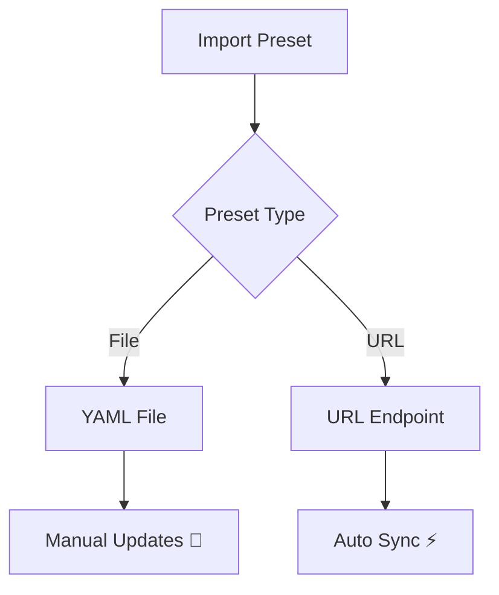
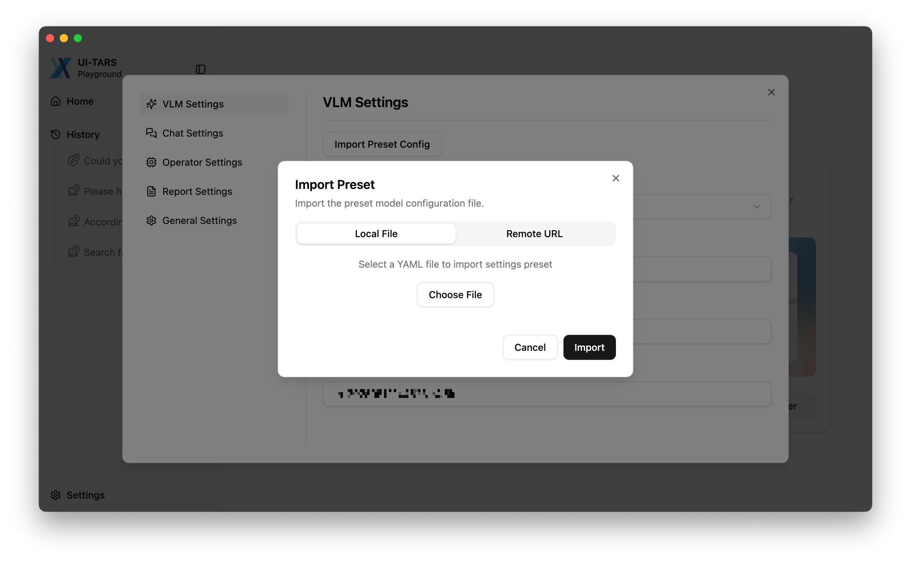
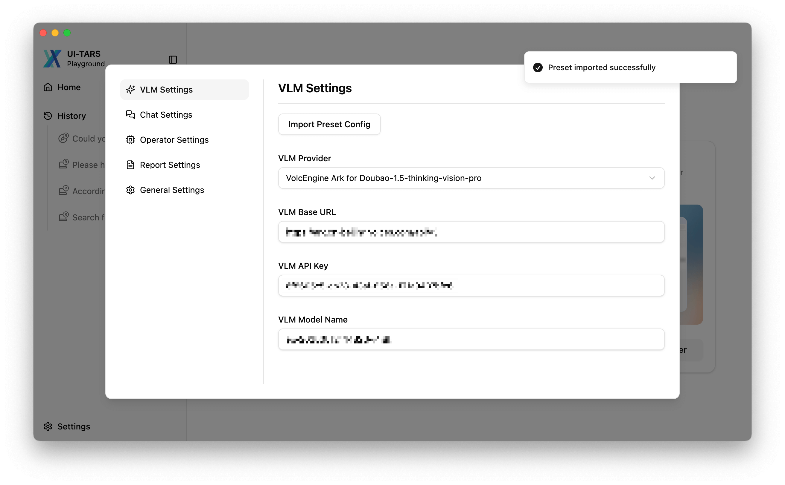
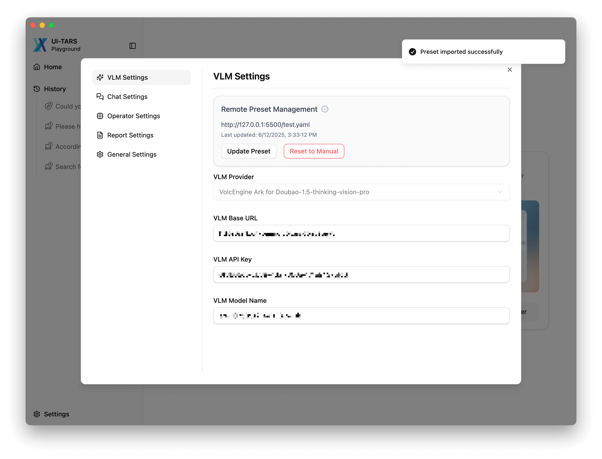

# Preset Management Guide

> [!IMPORTANT]  
> Currently, **UI-TARS Desktop** does not directly provide server-side capabilities, so we do not provide a Preset for the open source community. welcome community developers to contribute your presets [here](../examples/presets/).

A **preset** is a collection of [settings](./setting.md)  (_Introduced at [#61](https://github.com/bytedance/UI-TARS-desktop/pull/61)_), **UI-TARS Desktop** supports import presets via `files` or `URLs`:



<br>


## Preset Types Comparison

| Feature               | Local Presets          | Remote Presets         |
|-----------------------|------------------------|------------------------|
| **Storage**           | Device-local           | Cloud-hosted          |
| **Update Mechanism**  | Manual                 | Automatic             |
| **Access Control**    | Read/Write             | Read-Only             |
| **Versioning**        | Manual                 | Git-integrated        |


<br>


## Examples

### Import from file

**UI-TARS Desktop** supports importing presets from files. Once the file is parsed successfully, the settings will be automatically updated.

| Function | Snapshot |
| --- | ---|
| Open Setting | |
| Import Success | |
| Exception: Invalid Content |  |


<br>


### Import from URL

**UI-TARS Desktop** also supports importing presets from URLs. If automatic updates are set, presets will be automatically pulled every time the application is started.

| Function | Snapshot |
| --- | ---|
| Open Setting |  |
| Import Success (Default) |  |


<br>


### Preset Example

```yaml
name: UI TARS Desktop Example Preset
language: en
vlmProvider: Hugging Face for UI-TARS-1.5
vlmBaseUrl: https://your-endpoint.huggingface.cloud/v1
vlmApiKey: your_api_key
vlmModelName: your_model_name
reportStorageBaseUrl: https://your-report-storage-endpoint.com/upload
utioBaseUrl: https://your-utio-endpoint.com/collect
```

See all [example presets](../examples/presets).

