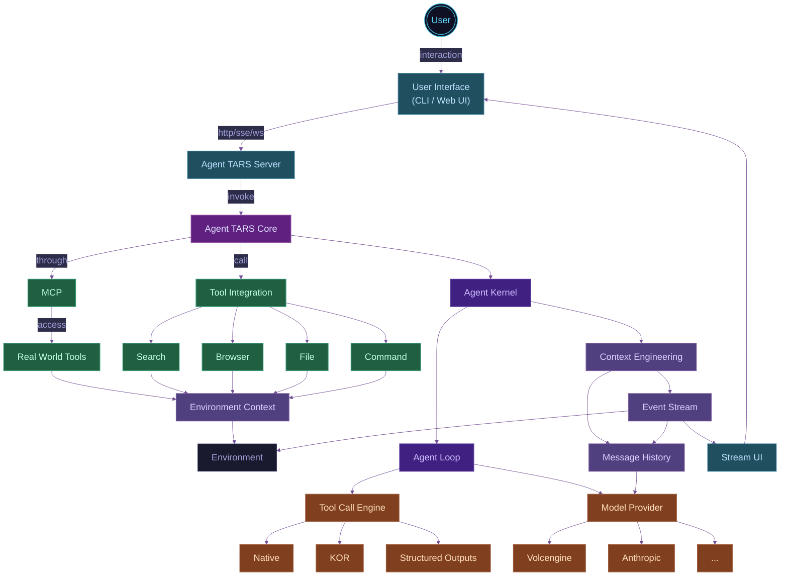

import { Badge } from '@theme';
import {
  IntroAnimation,
  ShowcasePanels,
  VideoPanel,
  Figure,
  Grid,
  GridItem,
  SocialCallout
} from '../../../src/components';
import { PiStarFourDuotone } from 'react-icons/pi';
import { CgTerminal } from 'react-icons/cg';

# <PiStarFourDuotone style={{display: 'inline-block', color:'#0ff'}}/> Introducing Agent TARS Beta

<br />

<VideoPanel
  src="https://lf3-static.bytednsdoc.com/obj/eden-cn/zyha-aulnh/ljhwZthlaukjlkulzlp/docs/videos/quick-start.mp4"
  loop
  autoPlay
/>

<br />

<SocialCallout />

<br />
<br />

## Looking Back

In March, we open-sourced an early [technical preview](https://agent-tars.com/2025/03/18/announcing-agent-tars-app) of Agent TARS. Agent TARS's tagline is <u>"an open-source multimodal AI agent offering seamless integration with various real-world tools"</u>. After its release, it received some support from the community and gained a certain influence.

<br />

<ShowcasePanels
  defaultHeight="140px"
  panels={[
    {
      content: ,
      title: 'agent-tars.com',
      link: 'https://agent-tars.com',
    },
    {
      content: ,
      title: 'agent-tars.com/showcase',
      link: 'https://agent-tars.com/showcase',
    },
    {
      content: <VideoPanel src="/alpha/showcase.mp4" controls={false} autoPlay />,
      title: 'first demo',
    },
  ]}
/>

<br />

<ShowcasePanels
  defaultHeight="80px"
  panels={[
    {
      content: ,
      title: 'community Support ',
    },
    {
      content: ,
      title: 'trouble shooting',
    },
    {
      content: <VideoPanel src="/alpha/config-mcp-servers.mp4" controls={false} autoPlay />,
      title: 'MCP support',
    },
    {
      content: <VideoPanel src="/alpha/local-browser-search.mp4" controls={false} autoPlay />,
      title: 'Local browser search',
    },
    {
      content: <VideoPanel src="/alpha/reach-10000.mp4" controls={false} autoPlay />,
      title: '1000 stars',
    },
  ]}
/>

> _\* You can find all these past moments on our [official Twitter](https://x.com/agent_tars)._

After a period of iteration, on one hand, the Seed multimodal models were gradually enhanced with the successive releases of **[UI-TARS 1.5](https://seed-tars.com/1.5/)** and **[Doubao 1.5 VL](https://seed.bytedance.com/zh/tech/seed1_5_vl)**. On the other hand, we received a lot of feedback from the open-source community. Additionally, we faced challenges with the existing architecture struggling to support the project's long-term development, such as the Agent UI not being decoupled, making it difficult to support evaluation and independent use.

After a period of architectural design and iteration, we bring you the **Beta** version of **Agent TARS**. We will first introduce **Agent TARS** **CLI**, a **Multimodal** **AI Agent** tool designed to be "**available anytime, anywhere**".

## Cognition

Before introducing the new version, we'll share some of our understanding of Agent TARS design principles, which will help you understand this release. In the goals of the Agent TARS core team, a robust Agent system needs to do three things well:

1. [Context Engineering](#context-engineering)
2. [Observable and Evaluable](#observable-and-evaluable)
3. [Easy to Build Applications](#easy-to-build-applications)

<br />

### Context Engineering

"Building agents that run for a long time" has always been one of Agent TARS's long-term goals. Take the following example:

<VideoPanel
  src="https://lf3-static.bytednsdoc.com/obj/eden-cn/zyha-aulnh/ljhwZthlaukjlkulzlp/docs/agent-tars-search-flight-info.mp4"
  controls
  autoPlay
  loop
/>

The Agent completed the task after about twenty rounds. Especially in multimodal tasks, without careful Context Engineering, the context can easily overflow. In Agent TARS, Context Engineering is reflected in the following aspects:

---

#### Take care of Context Window

In Agent TARS, the main components of the Memory for each Agent Loop are as follows:

<Figure src="/agent-loop-memory.png" title="Agent Loop Memory" zoom={1.4} maxWidth="70%" />

These contents are "dynamically" constructed into a request in each Agent Loop, and are affected by the model's Context Window. Up to now, typical model context windows are as follows:

{/* https://platform.openai.com/docs/models */} {/* https://docs.anthropic.com/en/docs/about-claude/models/overview */}

<Figure
  src="/llm-context-window.png"
  title="Typical model context window sizes (as of 2025.5)"
  zoom={1.3}
  maxWidth="50%"
/>

Taking a 128k context as an example, and assuming that for Research-type tasks, each tool call's Tool Result averages `5000` tokens, and if we ignore the System Prompt, we can deduce that without any processing, the Agent would overflow at round `26`, which is clearly insufficient for long-term operation.

At the same time, considering multimodal GUI Agents, and noting the differences in token calculation for images across different model services, we assume that a high-detail image can reach up to 5000 tokens<sup>[2]</sup>. To solve this problem, Agent TARS internally adopts a dynamic optimization strategy of "using different sliding windows for different modal contents" and optimizes and calculates for Context Window.

{/* https://www.reddit.com/r/OpenAI/comments/1k6od52/a_comparison_of_lowmediumhigh_with_new_images_api/ */}

---

#### MCP may bring instability

Since the early stages of Agent TARS, we have been building MCP. You can find our early practices in [MCP Brings a New Paradigm to Layered AI Application Development](https://agent-tars.com/2025/03/25/mcp-brings-a-new-paradigm-to-layered-ai-app-development).

In Agent TARS Beta, we still use a similar architecture internally, but with slight differences. This stems from new challenges we faced. We found that while MCP effectively solved the problem of "separating Agent developers from tool developers," it seemed to bring some chaos to Context Engineering:

<Figure
  src="/agent-call-mcp.png"
  title="How MCP provides context for Agent"
  zoom={1.4}
  maxWidth="75%"
/>

From the figure above, if we adopt the standard "separation" approach, where the Agent fully trusts the Tool Definitions and Tool Results obtained through the MCP Client from MCP Servers, you may face the following problems:

1. **Potential tool parameter issues**: Especially with models that perform Schema Strict Checks on Parameters, you might not be able to run;
2. **Tool Result size issues**: A poorly designed MCP can cause Context Overflow in just one round of calls, as shown below:

::: danger Frustrating Context Overflow Error

> 400 This model's maximum context length is 128000 tokens. However, your messages resulted in 138773 tokens. Please reduce the length of the messages.

:::

Yes, the second problem is the core issue discussed here. Especially in MCP Browser practices, we found that tools like `browser_get_html` and `browser_get_text` would cause the Agent to fail on many websites. To address this, we had to either discard these tools or replace them with better implementations, such as the `browser_get_markdown` built on [Readability](https://github.com/mozilla/readability) with pagination capabilities.

::: tip Insights about MCP

Based on the above, we can roughly draw the following inference: The more an Agent needs fine-grained Context Engineering control, the less it may need MCP's silent Prompt injection behavior. Even with MCP integration, Agent developers still need to perform many fine-grained controls just like operating Function Tools. From this perspective, MCP's value for production-level Agents should be a standardized Tool distribution protocol, rather than freely expanding Tools through methods like `mcpServers`.

We have many more practices and opinions about MCP, so please stay tuned for our future updates.

:::

Currently, various MCP Registries exist in the community with varying quality. In the long term, the MCP ecosystem should have a standard Benchmark set that provides clear reference scores for each tool's performance (such as model compatibility, context compression rate, performance, etc.), to help Agent developers make better choices.

---

#### Context Compress

Is doing the above enough? Clearly not. In Agent TARS's upcoming plans, we are promoting a multi-level Memory design:

| Level | Definition |
| --- | --- |
| L0（Permanet） | Permanent memory, preserved across all Session Runs, such as user initial input messages and Agent's Answers |
| L1（Run） | Memory effective only in the current Session Run, such as the Plan for the current Run |
| L2（Loop） | Memory effective only in the current Run Loop, such as Tool Call, Tool Result, environmental input (screenshots), etc. |
| L3（Ephemeral） | Temporary memory, such as streaming message chunks and Agent's one-time status |

<Figure src="/hierarchical-context.png" title="Hierarchical context" zoom={1.3} maxWidth="80%" />

Next, combining the above stratification strategy, we will further adopt some strategies to compress different levels of Context:

- [Selective Context](https://arxiv.org/abs/2304.12102): Using intelligent compression algorithms to reduce message content
- Summary: Using LLM / SLM to generate conversation summaries

::: tip Responses API

Additionally, we are planning to extend Agent support for the [Responses API](https://platform.openai.com/docs/api-reference/responses) based on the [Chat Completion](https://platform.openai.com/docs/api-reference/chat) Protocol, leveraging LLM Serving's Image Cache to further improve performance in multimodal reasoning task scenarios.

:::

---

### Observable and Evaluable

<b>"Observability and evaluability are issues that all Agent Frameworks face and need."</b> Here, we mainly explain some differences in Agent TARS's construction and our evolutionary direction.

#### Snapshot

In Agent TARS, the main challenge in long-step task scenarios is that the internal details of the Agent become increasingly difficult to observe, posing huge challenges to the stability of continuous framework iteration. For this, we need to introduce a mechanism to observe Agent operation. In Agent TARS Kernel, there are many environmental factors during Agent operation, such as:

1. LLM: Even for the same input, LLM Responses are filled with enormous randomness;
2. Environment initialization: Starting and lifecycle management of Local tools or Remote virtual containers (including Browser);
3. Tools: Uncontrollable Tool Calls and MCP calls, especially MCP with time-consuming Connect processes;

<Figure
  src="/changing-environment.png"
  title="Complex and constantly changing environment"
  zoom={1.3}
  maxWidth="80%"
/>

For this, we need to introduce a design pattern that can save the environment on which the Agent depends as a Snapshot at runtime, and then replay the Agent based on the Snapshot to ensure that the Agent's Context, Run Loop state, and final Response remain deterministic. Finally, our designed Snapshot framework example is as follows:

```ts
import { Agent } from '@multimodal/agent';
import { AgentSnapshot } from '@multimodal/agent-snapshot';

const agent = new Agent({
  /* Agent Options */
});
const agentSnapshot = new AgentSnapshot(agent, {
  snapshotPath: './fixtures/',
});

// generate
await agentSnapshot.generate(runOptions);
// replay
await agentSnapshot.replay(runOptions);
```

This framework has already powered Agent TARS's [continuous integration](https://github.com/bytedance/UI-TARS-desktop/blob/85a0f62a222298daaa203e7757aaa91abf4209d5/multimodal/agent/snapshot/runner.ts), driving the testing of [@multimodal/agent](https://www.npmjs.com/@multimodal/agent), [@mcp-agent/core](https://www.npmjs.com/package/@mcp-agent/core), and [@magent-tars/core](https://www.npmjs.com/package/@agent-tars/core), currently helping us avoid at least 10+ issues in Beta development:

<br/ >

<ShowcasePanels
  panels={[
    {
      content: (
        <VideoPanel
          src="https://lf3-static.bytednsdoc.com/obj/eden-cn/zyha-aulnh/ljhwZthlaukjlkulzlp/docs/videos/agent-snapshot-vitest.mp4"
          controls={false}
          autoPlay
        />
      ),
      title: 'Snapshot-based environment replay agent',
    },
    {
      content: (
        <VideoPanel
          src="https://lf3-static.bytednsdoc.com/obj/eden-cn/zyha-aulnh/ljhwZthlaukjlkulzlp/docs/videos/agent-snapshot-replay-failed.mp4"
          controls={false}
          autoPlay
        />
      ),
      title: 'Discovering framework iteration bugs',
    },
  ]}
/>

<br />

#### Benchmark

In Alpha, Agent TARS was an Electron application, so we could only evaluate it manually, which was inefficient. Starting from Beta, Agent TARS brings a new architecture with Agent and UI layering, and the Headless running mode makes automated evaluation possible. We referenced OpenAI's [simple-evals](https://github.com/openai/simple-evals), and implemented a [browsecomp](https://github.com/agent-infra/browsecomp) evaluation method for Agent TARS through cross-process calls between Python and TypeScript:

```bash
python browsecomp.py --command "/path/to/agent-tars" --examples 1
```

In addition, we are also building some basic evaluation sets for MCP Tools, which are currently used to evaluate the cross-model compatibility performance of MCP Agent within Agent TARS. Once these capabilities are fully improved, we will introduce a complete Benchmark solution in the official version.

---

### Easy to build applications

"Agent applications" is a key direction that Agent TARS has been focusing on and designing. A good Agent solution should make it easy to build applications.

#### Agent Event Stream

To help you quickly understand what Event Stream is, we'll demonstrate with a real example. When you start Agent TARS CLI locally, you'll be able to trigger a task execution using `curl`:

```bash
curl --location 'http://localhost:8888/api/sessions/query/stream' \
--header 'Content-Type: application/json' \
--data '{
    "sessionId": "7oydcIJGJQcvaGdjbAQHz",
    "query": "What is my computer model?"
}'
```

You'll see the Agent's Response being output like a Stream:

<VideoPanel
  src="https://lf3-static.bytednsdoc.com/obj/eden-cn/zyha-aulnh/ljhwZthlaukjlkulzlp/docs/videos/agent-tars-query-stream.mp4
"
  autoPlay
  loop
/>

This includes Agent status, Tool call details, final Agent replies, environment information, and more. Yes, this design makes the entire Agent running process completely visible, allowing you to easily build your own Agent UI based on this Event Stream:


The benefit is not just that the Agent and UI follow certain protocols; if you don't like the UI, you can also replace the UI implementation — yes, this is also one of Agent TARS's future visions, supporting the community to define different Agent TARS UI implementations.

<br />

<p align="center" className="text-sm">
  <b>
    <i>"In a sense, Agent UI is just a Replay of Agent Event Stream"</i>
  </b>
</p>

<br />

This stems from Agent TARS's Kernel being built on Event Stream itself. You'll be able to experience the elegance of these data structures through Agent TARS's SDK:

```ts
async function main() {
  const stream = await agent.run({
    input: "How's the weather today?",
    stream: true,
  });

  for await (const chunk of stream) {
    console.log(JSON.stringify(chunk));
  }
}
```

You'll get the following output:

```jsonl
{"id":"b61e0b7b-1ab0-4507-acd6-a6ba04de7e19","type":"assistant_message","timestamp":1750188853755,"content":"","toolCalls":[{"id":"call_v7VGHOkHf5kDpftNKP46neuv","type":"function","function":{"name":"getCurrentLocation","arguments":"{}"}}],"finishReason":"tool_calls","messageId":"msg_1750188853746_cnb5urei"}
{"id":"89876ba2-33f5-4623-9949-84bab8b5b63c","type":"tool_call","timestamp":1750188853756,"toolCallId":"call_v7VGHOkHf5kDpftNKP46neuv","name":"getCurrentLocation","arguments":{},"startTime":1750188853756,"tool":{"name":"getCurrentLocation","description":"Get user's current location","schema":{"type":"object","properties":{}}}}
{"id":"539e0378-47a9-4585-b27f-dc94007ff8d5","type":"tool_result","timestamp":1750188853757,"toolCallId":"call_v7VGHOkHf5kDpftNKP46neuv","name":"getCurrentLocation","content":{"location":"Boston"},"elapsedMs":1}
{"id":"4e22c5a2-7520-4e60-99a0-388db0e8ed13","type":"assistant_message","timestamp":1750188854919,"content":"","toolCalls":[{"id":"call_lF1zR8bN3uF0uHK1MmWGvCAk","type":"function","function":{"name":"getWeather","arguments":"{\"location\":\"Boston\"}"}}],"finishReason":"tool_calls","messageId":"msg_1750188854825_sj6xqhs4"}
{"id":"484f733f-d8c7-49db-a1e3-0f8312b726a0","type":"tool_call","timestamp":1750188854920,"toolCallId":"call_lF1zR8bN3uF0uHK1MmWGvCAk","name":"getWeather","arguments":{"location":"Boston"},"startTime":1750188854919,"tool":{"name":"getWeather","description":"Get weather information for a specified location","schema":{"type":"object","properties":{"location":{"type":"string","description":"Location name, such as city name"}},"required":["location"]}}}
{"id":"373f04fe-dd00-4c1d-a394-be6ff7f24d51","type":"tool_result","timestamp":1750188854920,"toolCallId":"call_lF1zR8bN3uF0uHK1MmWGvCAk","name":"getWeather","content":{"location":"Boston","temperature":"70°F (21°C)","condition":"Sunny","precipitation":"10%","humidity":"45%","wind":"5 mph"},"elapsedMs":0}
{"id":"ebde4cf4-ad2a-41b4-962f-bb8c1522c487","type":"assistant_streaming_message","timestamp":1750188855408,"content":"The","isComplete":false,"messageId":"msg_1750188855395_phxytayw"}
{"id":"861394e1-0875-4021-b885-17217af0f5af","type":"assistant_streaming_message","timestamp":1750188855409,"content":" weather","isComplete":false,"messageId":"msg_1750188855395_phxytayw"}
// ...
{"id":"32ae7cda-fc17-4ebf-b919-9efe38db3f2e","type":"assistant_streaming_message","timestamp":1750188855857,"content":".","isComplete":false,"messageId":"msg_1750188855395_phxytayw"}
{"id":"85d06697-25b7-4c85-a04f-f8df550ccef1","type":"assistant_message","timestamp":1750188855867,"content":"The weather in Boston today is sunny with a temperature of 70°F (21°C). The precipitation chance is 10%, humidity is at 45%, and there's a gentle wind blowing at 5 mph.","finishReason":"stop","messageId":"msg_1750188855395_phxytayw"}
```

This design makes the architecture of Agent TARS Server and Agent TARS Web UI simple enough. You only need to focus on Session management and implement a Renderer specifically for AgentEventStream — what we call `<EventStreamRenderer />`.

---

#### Agent-UI Protocol

[AG-UI](https://docs.ag-ui.com/introduction) is a cutting-edge protocol aimed at standardizing the connection between frontend applications and AI Agents through an open protocol. Does this sound similar to the Agent Event Stream mentioned above? Yes, indeed. When AG-UI was released, we took note of this protocol and conducted thorough research and study. We found many valuable aspects of the AG-UI Protocol, such as [State Management Events](https://docs.ag-ui.com/sdk/js/core/events#state-management-events), which, based on the [JSON Patch format (RFC 6902)](https://datatracker.ietf.org/doc/html/rfc6902), enables more natural `START-CONTENT-END` incremental state updates.

Here, we need to explain some differences between Agent Event Stream in Agent TARS and Agent-UI Protocol:

| Scenario | Agent Event Stream | Agent-UI Protocol |
| --- | --- | --- |
| Build UI | YES | YES |
| Build Context | YES | NO |

Yes, Agent Event Stream is also used internally in Agent TARS to build Context, referring to the [Context Engineering](#context-engineering) mentioned earlier. Doesn't it all connect? Regarding the details of Agent Event Stream, we will write a separate Blog post to introduce it to everyone in the future.

<br />

Well, above we have explained some key insights in building Agent TARS Beta, hoping these will help you understand this release. Next, we will formally introduce the capability changes brought by Agent TARS Beta.

<br />

## New Features

### Agent TARS CLI

Starting from Beta, Agent TARS's application form has evolved from an Electron App to a CLI, bringing a new Web UI based on a [new architecture](#archtecutre-improvement):

<br />


<br />

<h4>**Why Choose CLI?**</h4>

This stems from CLI's advantages without losing core capabilities:

1. **Easier updates and iterations**: Currently, `@agent-tars/cli` has iterated through 35 versions, far exceeding the early Electron's 9 versions, allowing us to fix user-encountered issues faster;
2. **Significant installation size advantage**: This is mainly because Agent TARS CLI doesn't need to package a [Chromium](https://www.chromium.org/), with specific size advantages shown in the figure below.

<Figure src="/compare-install-size.png" title="Compare install size" zoom={1} />

For usage guidelines of `@agent-tars/cli`, please visit [Quick Start](../guide/get-started/quick-start.mdx).

<br />

### Hybrid Browser GUI Agent

In the early preview version, Agent TARS adopted the same DOM Extraction approach as [browser-use](https://github.com/browser-use/browser-use), detecting interactive element sequences through DOM analysis. The LLM would reason and output the element number to operate next, completing the operation process:

<Grid columns={2} gap="md">
  <GridItem>
    <Figure src="/browser-control-dom.png" title="Build DOM Tree And Highlight" />
  </GridItem>
  <GridItem>

```html
[1]</img>
[2]<button>Captcha solver</button>
[3]<a>Entry job</a>
[4]<a>API</a>
[5]<a>Proxy</a>
[6]<a>Software</a>
[7]<a>Blog</a>
[8]<a>Sign up</a>
[9]<a>Log in</a>
// ...
```

  </GridItem>
</Grid>

In Agent TARS Beta, we introduce a visual control solution based on [UI-TARS](https://seed-tars.com/). The logic for operating the Browser is closer to how humans understand screens. The VLM first sees the screen, then thinks and outputs specific actions to perform (such as clicking, dragging, etc.), ultimately completing browser control tasks.

```bash
click(point='<point>383 502</point>')  # 1. Activate input field
type(content='W9H5K')                  # 2. Enter captcha code
click(point='<point>339 607</point>')  # 3. Click Check button to complete
```

Let me show you this difference with a very simple CAPTCHA task:

```bash
Open https://2captcha.com/demo/normal and pass it
```

First with DOM-based approach, since it's based on LLM that can't see the screen, the operation path is very complex and ultimately fails:

<br />

<VideoPanel
  src="https://lf3-static.bytednsdoc.com/obj/eden-cn/zyha-aulnh/ljhwZthlaukjlkulzlp/docs/videos/dom-captcha.mp4"
  autoPlay
/>

<br />

Then with Visual Grounding, since the model can see the screen, the VLM performs visual reasoning and outputs Click and Type Actions, quickly completing the task:

<br />

<VideoPanel
  src="https://lf3-static.bytednsdoc.com/obj/eden-cn/zyha-aulnh/ljhwZthlaukjlkulzlp/docs/videos/CAPTCHA.mp4"
  autoPlay
/>

<br />

From the final released API, we provide three operation methods:

| Term | Introduction |
| --- | --- |
| `dom` | Operation capabilities based on DOM analysis [Browser Use](https://www.npmjs.com/@agent-infra/mcp-server-browser), which was the approach in early versions of Agent TARS. |
| `visual-grounding` | Operation capabilities based on GUI Agent ([UI-TARS](https://seed-tars.com/) / [Doubao 1.5 VL](https://www.volcengine.com/docs/82379/1554521)), without DOM-related tools. |
| `hybrid` | Operation capabilities including both `visual-grounding` and `dom` |

For how to use and more details, please visit [Browser Operation](../guide/basic/browser.mdx).

---

### Better Cross-Model Compatibility

In Agent TARS's early preview version, we only supported Claude 3.7, but we still received numerous requests from the community for compatibility with various models. We initiated a Discussion about [Model Compatibility #377](https://github.com/bytedance/UI-TARS-desktop/discussions/377), but due to architecture limitations at that time, we couldn't quickly achieve good model compatibility.

Finally, starting from Beta, we completely rewrote the Model Provider layer implementation. After actual testing, we can finally tell you that we've brought better model compatibility. Now, Agent TARS can run on Model Providers such as Volcengine, Anthropic, and OpenAI.

Currently, the compatibility list for typical models is as follows:

| Model Provider | Model             | Text | Vision | Tool Call & MCP | Visual Grounding |
| ------------- | ----------------- | ---- | ------ | --------------- | ---------------- |
| `volcengine`  | Seed1.5-VL        | ✔️   | ✔️     | ✔️              | ✔️               |
| `anthropic`   | claude-3.7-sonnet | ✔️   | ✔️     | ✔️              | 🚧               |
| `openai`      | gpt-4o            | ✔️   | ✔️     | ✔️              | 🚧               |

### Native Streaming

In the new version of Agent TARS, we built the entire architecture on Streaming, significantly improving the interactive experience for complex tasks:

<VideoPanel
  src="https://lf3-static.bytednsdoc.com/obj/eden-cn/zyha-aulnh/ljhwZthlaukjlkulzlp/docs/videos/streaming.mp4"
  controls={false}
  autoPlay
/>

<br />

---

### Web UI

Thanks to the [Agent Event Stream](#agent-event-stream) introduced in the new version of Agent TARS, Web UI can be developed completely independently and interact with [Agent TARS Server](../guide/basic/server.mdx) through protocols. Ultimately, we bring a clean Web UI:

<Grid columns={2} gap="md">
  <GridItem>
    <Figure src="/web-ui.png" title="Agent TARS Web UI (Dark)" />
  </GridItem>
  <GridItem>
    <Figure src="/web-ui-light.png" title="Agent TARS Web UI (Light)" />
  </GridItem>
</Grid>

#### GUI Grounding Transition

This design was first introduced in the release of [UI TARS 1.5](https://seed-tars.com/1.5/). Starting from Agent TARS Beta, Agent TARS supports GUI Grounding, and the process includes "real-time mouse tracking":

<VideoPanel
  src="https://lf3-static.bytednsdoc.com/obj/eden-cn/zyha-aulnh/ljhwZthlaukjlkulzlp/docs/videos/flight.mp4"
  loop
  autoPlay
/>

<br />
<br />

#### Share and Reply

Agent TARS Web UI supports saving Replays locally by default, and also supports configuring [share.provider]() to upload to your server.

<Grid columns={2} gap="md">
  <GridItem>
    
  </GridItem>
  <GridItem>
    <VideoPanel
      src="https://lf3-static.bytednsdoc.com/obj/eden-cn/zyha-aulnh/ljhwZthlaukjlkulzlp/docs/videos/share.mp4"
      loop
      autoPlay
    />
  </GridItem>
</Grid>

<br />

#### Multimodal I/O

The new version of Agent TARS not only initially supports multimodal input in the Web UI, but more notably, Agent TARS Web UI has internally implemented some General multimodal content renderers that can select appropriate UI for rendering without coupling with specific Tools and MCP Servers:


---

### Architecture Improvements

Based on the [Cognition](#cognition) above, we completely rewrote Agent TARS Beta, bringing a brand-new multi-layered architecture built on an Event Stream-driven Agent Kernel.

Overall, the main components of Agent TARS are as follows:

<br />



<br />

<p align="center" className="text-sm">
  <span>Architecture of Agent TARS Beta</span>
</p>

<br />

From a technical architecture perspective, Agent TARS Beta has evolved Agent TARS from an Electron App to an Agent ecosystem.

---

## Other Examples

In addition to the examples shown in the features introduction above, here are some examples demonstrated by internal developers. Although these capabilities are not officially supported by Agent TARS, thanks to continuous model capability improvement and [Context Engineering](#context-engineering) evolution:

### Recreating Applications

Agent TARS does not currently support Coding or Artifact Preview, but it does support multimodal input. You can write code using the File tool and implement preview with Browser:

```
Write code to completely restore the UI corresponding to this image
and write complete front-end code

Requirements:

Do not write Python, write HTML directly to File, and then use browser_nagivate
to this local file ALWAYS using following format to generate dummy images: https://picsum.photos/{width}/{height}?random={query},
select appropriate width, height, query as needed.
```

<VideoPanel
  src="https://lf3-static.bytednsdoc.com/obj/eden-cn/zyha-aulnh/ljhwZthlaukjlkulzlp/docs/videos/ui-coding.mp4"
  loop
  autoPlay
/>

<br />

Similarly, some developers have even achieved nearly professional UI output through Agent TARS's autonomous multi-round iterations:

<Figure src="/hangzhou-weather.jpeg" zoom={1} maxWidth="70%" />

<br />

### First Write a Game, Then Play It

With just one model, Doubao 1.5 VL, we completed writing a game, then "played" it ourselves, and finally "beat the computer" we programmed:

<VideoPanel
  src="https://lf3-static.bytednsdoc.com/obj/eden-cn/zyha-aulnh/ljhwZthlaukjlkulzlp/docs/videos/write-game-and-play-it.mp4"
  loop
  autoPlay
/>

For Agent TARS, this is a very valuable beginning. From the earliest UI-TARS-desktop, GUI Agent was the only first-class citizen, but now, GUI Agent is no longer an isolated entity, playing its role in an integrated environment!

<br />

### Illustrated Reports

This is another example that Agent TARS has been focusing on: how to generate multimodal content:

```
Open ProductHunt to collect the introductions and links of the top five projects,
then open the website of each project and take a screenshot and save it locally

Next, write a research report in HTML to express your thoughts and quote the
corresponding product pictures

Requirement: Do not write Python, write HTML directly to File, and then use
browser_nagivate to this local file
```

<VideoPanel
  src="https://lf3-static.bytednsdoc.com/obj/eden-cn/zyha-aulnh/ljhwZthlaukjlkulzlp/docs/videos/write-report-with-image.mp4"
  loop
  autoPlay
/>

<br />

## Conclusion

The release of Agent TARS Beta is just a beginning. In fact, we have only released the first default version of Agent TARS, while a version with dynamic planning reasoning is currently in internal testing. Agent TARS is still developing at a rapid pace. Although we have brought many new features in this release, there are still many aspects that need improvement, such as developer documentation and the presentation of deliverables. We will push for continuous subsequent releases as soon as possible, so please look forward to our updates.

In the future, we expect Agent TARS to truly become an Agent development tool that everyone can use anytime, anywhere. Welcome to use Agent TARS and communicate with us. Thank you to all community members who have supported us ❤️


## Citation

```
@misc{chen2025agenttars,
      title={Introducing Agent TARS}, 
      author={Haoli Chen* and Chaolin Jin, Xingyuan Yang, Hao Chen, Yujia Qin, Shihao Liang, Wanjun Zhong and Cheng Yuan*},
      year={2025},
      howpublished={https://agent-tars.com/beta},
}
```

## Next steps

import { ActionCardContainer } from '@components/ActionCardContainer';
import { ActionCard } from '@components/ActionCard';

<ActionCardContainer>
  <ActionCard
    title="Quick Start"
    description="Getting started with Agent TARS CLI"
    icon="🚀"
    href="../guide/get-started/quick-start.html"
    color="blue"
  />
  <ActionCard
    title="Discord"
    description="Join in Discord"
    icon="📚"
    href="https://discord.gg/HnKcSBgTVx"
    color="purple"
  />
</ActionCardContainer>
