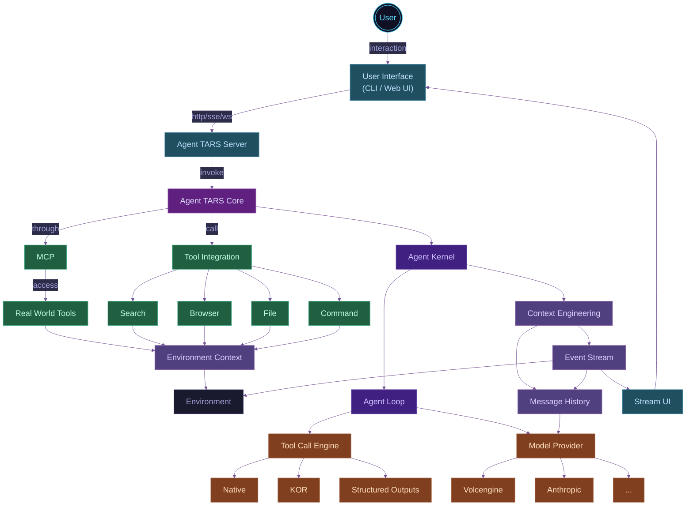

import { Badge } from '@theme';
import {
  IntroAnimation,
  ShowcasePanels,
  VideoPanel,
  Figure,
  Grid,
  GridItem,
  SocialCallout,
} from '../../../src/components';
import { PiStarFourDuotone } from 'react-icons/pi';
import { CgTerminal } from 'react-icons/cg';

# <PiStarFourDuotone style={{display: 'inline-block', color:'#0ff'}}/> Introducing Agent TARS Beta

<br />

<VideoPanel
  src="https://lf3-static.bytednsdoc.com/obj/eden-cn/zyha-aulnh/ljhwZthlaukjlkulzlp/docs/videos/quick-start.mp4"
  loop
  autoPlay
/>

<br />
<SocialCallout />

<br />

## 回顾

在三月份，我们开源了 Agent TARS 的早期 [Preview](https://agent-tars.com/2025/03/18/announcing-agent-tars-app) 版本。Agent TARS 的 Slogan 是<u>"一个开源的多模态 AI Agent，提供与各种现实世界工具的无缝集成的能力"</u>。在发布后，我们获得了社区的一些支持并积累了一定的影响力。

<br />

<ShowcasePanels
  defaultHeight="140px"
  panels={[
    {
      content: ,
      title: 'agent-tars.com',
      link: 'https://agent-tars.com',
    },
    {
      content: ,
      title: 'agent-tars.com/showcase',
      link: 'https://agent-tars.com/showcase',
    },
    {
      content: <VideoPanel src="/alpha/showcase.mp4" controls={false} autoPlay />,
      title: 'first demo',
    },
  ]}
/>

<br />

<ShowcasePanels
  defaultHeight="80px"
  panels={[
    {
      content: ,
      title: 'community Support ',
    },
    {
      content: ,
      title: 'trouble shooting',
    },
    {
      content: <VideoPanel src="/alpha/config-mcp-servers.mp4" controls={false} autoPlay />,
      title: 'MCP support',
    },
    {
      content: <VideoPanel src="/alpha/local-browser-search.mp4" controls={false} autoPlay />,
      title: 'Local browser search',
    },
    {
      content: <VideoPanel src="/alpha/reach-10000.mp4" controls={false} autoPlay />,
      title: '1000 stars',
    },
  ]}
/>

> _\* 这些过去的时刻，你都可以在我们的[官方推特](https://x.com/agent_tars)中找到。_

在一段时间的迭代后，一方面，Seed 多模态模型逐步增强，如 **[UI-TARS 1.5](https://seed-tars.com/1.5/)** 和 **[Doubao 1.5 VL](https://seed.bytedance.com/zh/tech/seed1_5_vl)** 的相继发布，另一方面，在开源社区上我们收到了了较多的反馈，此外，我们也面临现有架构难以支撑项目长期发展的挑战，如 Agent UI 没有解耦，难以支撑评测和独立使用。

在经过一段时间的架构设计和迭代后，我们带来了 **Agent TARS** 的 **Beta** 版本，我们将首先为你推出 **Agent TARS** **CLI**，一款旨在让你 "**随时随地可用**" 的 **Multimodal** **AI Agent** 工具。

## 认知

在进入正式新版本介绍之前，我们会为你介绍一些我们对 Agent TARS 的设计原则的认知，将有助于你理解这次发布。在 Agent TARS 核心团队的目标里，一个健壮的 Agent 体系，需要做好三件事：

1. [Context Engineering](#context-engineering)
2. [Observable and Evaluable](#observable-and-evaluable)
3. [Easy to build applications](#easy-to-build-applications)

<br />

### Context Engineering

"构建长时间运行的 Agent"一直是 Agent TARS 的长期目标之一，以下面的例子为例：

<VideoPanel
  src="https://lf3-static.bytednsdoc.com/obj/eden-cn/zyha-aulnh/ljhwZthlaukjlkulzlp/docs/agent-tars-search-flight-info.mp4"
  controls
  autoPlay
  loop
/>

Agent 经过二十轮左右完成了任务，尤其是在多模态任务下，如果没有细致的 Context Engineering，Context 非常容易溢出。在 Agent TARS 中，我们对 Context Engineering 的理解主要体现在以下几个方面：

---

#### Take care of Context Window

在 Agent TARS 中，每一轮 Agent Loop 的 Memory 的主要组成部分如下：

<Figure src="/agent-loop-memory.png" title="Agent Loop Memory" zoom={1.4} maxWidth="70%" />

这些内容会在每一个 Agent Loop 中，被 "动态" 构造为一个请求，并受到模型的 Context Window 的影响。截止目前，典型的模型上下文窗口如下：

{/* https://platform.openai.com/docs/models */} {/* https://docs.anthropic.com/en/docs/about-claude/models/overview */}

<Figure
  src="/llm-context-window.png"
  title="典型模型的上下文窗口大小 (截至 2025.5)"
  zoom={1.3}
  maxWidth="50%"
/>

我们以 128k 上下文为例，假设以 Research 类任务为代表的每轮工具调用的 Tool Result 平均为 `5000` tokens，若 System Prompt 忽略不计，我们可以推导出在没有任何处理的情况下，Agent 会在第 `26` 轮溢出，这显然无法做到长期运行。

与此同时，如果考虑到多模态 GUI Agent，考虑到不同模型的 Serving 在 image 的 token 计算上有一些差异，我们假设 `detail:high` 下一张图高达 5000 tokens<sup>[2]</sup>。为了解决这一问题，Agent TARS 内部采用了 "针对不同模态的内容采用不同的滑动窗口" 的动态优化策略，并面向 Context Window 进行优化和计算。

{/* https://www.reddit.com/r/OpenAI/comments/1k6od52/a_comparison_of_lowmediumhigh_with_new_images_api/ */}

---

#### MCP may bring instability

从 Agent TARS 早期阶段开始，我们一直在建设 MCP，你可以在 [MCP Brings a New Paradigm to Layered AI Application Development](https://agent-tars.com/2025/03/25/mcp-brings-a-new-paradigm-to-layered-ai-app-development) 找到我们早期的实践。

在 Agent TARS Beta 中，我们内部仍然采用了类似的架构，但略有不同。这源于我们面临的新挑战，我们发现，MCP 虽然有效地解决了 "Agent 开发者与工具开发者分离" 的问题，但在 Context Engineering 这件事上，MCP 似乎带来了一些混沌：

<Figure src="/agent-call-mcp.png" title="MCP 如何为 Agent 提供上下文" zoom={1.4} maxWidth="75%" />

从上述的图中可以看出，如果我们采用标准的 "分离" 做法，即 Agent 充分信任通过 MCP Client 获取到的来自 MCP Servers 的 Tool Definitions 和 Tool Result，那么，你可能会面临如下问题：

1. **Tool 参数的潜在问题**：尤其是在部分对 Parameters 进行了 Schema Stric Check 的模型中，你可能无法运行；
2. **Tool Result 过大的问题**：一个 "出品不佳" 的 MCP，一轮调用即可导致 Context Overflow，如下：

::: danger 令人抓狂的 Context Overflow 错误

> 400 This model's maximum context length is 128000 tokens. However, your messages resulted in 138773 tokens. Please reduce the length of the messages.

:::

没错，第二个问题是这里讨论的核心问题，尤其是在 MCP Browser 的实践中，我们发现以 `browser_get_html`、`browser_get_text` 为代表的工具，会导致 Agent 在大量网站上无法运行。为此，我们不得不去废弃这些工具，或换取更好的实现，如带分页能力的基于 [Readability](https://github.com/mozilla/readability) 构建的 `browser_get_markdown`。

::: tip 关于 MCP 的洞见

基于上述引述，我们大抵可以得出以下推论：如果一个 Agent 越需要细粒度的 Context Engineering 控制，那么他可能就越不需要 MCP 的静默 Prompt 注入行为。即便接入了 MCP，Agent 开发者仍然需要像操作 Function Tool 一样进行很多细粒度的控制。从这个角度看，MCP 对于生产级 Agent 的价值应该是标准化的 Tool 分发协议，而非通过 `mcpServers` 等方式自由拓展 Tool。

关于 MCP 的实践和观点我们还有很多，请期待我们后续的更新。

:::

目前，社区存在各种各样的 MCP Registry，其质量参差不齐，从长期发展来看，MCP 的生态应当有一套标准的 Benchmark，为每个工具的各项表现（如模型兼容性、上下文压缩率、性能等等）得出明确的评分参考，以便 Agent 开发者更好的选择。

---

#### Context Compress

做到上面这些就够了吗？显然不够，在 Agent TARS 接下来的计划中，我们正在推动完成一种多级 Memory 设计：

| Level | Deifntion |
| --- | --- |
| L0（Permanet） | 永久记忆，跨所有 Session Run 保留，如用户初始输入消息、Agent 的 Answer |
| L1（Run） | 仅在当前 Session Run 中生效的记忆，如当前 Run 的 Plan |
| L2（Loop） | 仅在当前 Run Loop 中生效的记忆，如 Tool Call、Tool Result、 环境输入（屏幕截图）等 |
| L3（Ephemeral） | 临时记忆，如流式的消息 Chunk、 Agent 的 One-time status |

<Figure src="/hierarchical-context.png" title="分层上下文" zoom={1.3} maxWidth="80%" />

接着，结合上述的分级策略，我们会进一步采用一些策略来针对不同 Level 的 Context 进行压缩：

- [Selective Context](https://arxiv.org/abs/2304.12102)：使用智能压缩算法减少消息内容
- Summary：使用 LLM / SLM 生成对话摘要

::: tip Responses API

除此之外，我们正在计划在 [Chat Completion](https://platform.openai.com/docs/api-reference/chat) Procotol 的基础上，让 Agent 继续支持 [Responses API](https://platform.openai.com/docs/api-reference/responses)，利用 LLM Serving 的 Image Cache 进一步提升多模态推理任务场景下的性能。

:::

---

### Observable and Evaluable

<b>"可观测，与可评估"，是所有 Agent Framework 都会面临和需要的问题"</b>。这里，我们主要阐述一下
Agent TARS 中建设的差异，以及我们的一些演进方向。

#### Snapshot

在 Agent TARS 中，由于主要的场景是 Long-steps task，在此类场景下面临的主要挑战是 Agent 的内部细节越来越难以观测，框架持续迭代的稳定性面临巨大挑战，为此，我们需要引入一种观测 Agent 运行的机制。在 Agent TARS Kernel 中，Agent 在运行期间来自环境的因素非常多，如：

1. LLM：即便是针对相同的输入，LLM Response 充满着巨大的随机性；
2. 环境初始化：Local 工具或 Remote 虚拟容器（包含 Browser）的启动，与生命周期的管理；
3. 工具：不可控的 Tool Call 与 MCP 调用，尤其是存在重耗时 Connect 过程的 MCP；

<Figure src="/changing-environment.png" title="复杂且不断变化的环境" zoom={1.3} maxWidth="80%" />

为此，我们需要引入一种设计模式，能够在运行时将 Agent 所依赖的环境保存为 Snapshot，接着，可以基于 Snapshot 来回放 Agent，确保 Agent 的 Context、Run Loop state，与最终的 Response 保持确定。最终，我们设计的 Snapshot 框架示例如下：

```ts
import { Agent } from '@multimodal/agent';
import { AgentSnapshot } from '@multimodal/agent-snapshot';

const agent = new Agent({
  /* Agent Options */
});
const agentSnapshot = new AgentSnapshot(agent, {
  snapshotPath: './fixtures/',
});

// generate
await agentSnapshot.generate(runOptions);
// replay
await agentSnapshot.replay(runOptions);
```

这一框架已经驱动了 Agent TARS 的 [持续集成](https://github.com/bytedance/UI-TARS-desktop/blob/85a0f62a222298daaa203e7757aaa91abf4209d5/multimodal/agent/snapshot/runner.ts)，驱动了 [@multimodal/agent](https://www.npmjs.com/@multimodal/agent)、[@mcp-agent/core](https://www.npmjs.com/package/@mcp-agent/core)、[@magent-tars/core](https://www.npmjs.com/package/@agent-tars/core) 的测试，目前帮助我们在 Beta 的开发中至少规避了 10+ Issues：

<br/ >

<ShowcasePanels
  panels={[
    {
      content: (
        <VideoPanel
          src="https://lf3-static.bytednsdoc.com/obj/eden-cn/zyha-aulnh/ljhwZthlaukjlkulzlp/docs/videos/agent-snapshot-vitest.mp4"
          controls={false}
          autoPlay
        />
      ),
      title: '基于 Snapshot 的环境回放 agent',
    },
    {
      content: (
        <VideoPanel
          src="https://lf3-static.bytednsdoc.com/obj/eden-cn/zyha-aulnh/ljhwZthlaukjlkulzlp/docs/videos/agent-snapshot-replay-failed.mp4"
          controls={false}
          autoPlay
        />
      ),
      title: '发现框架迭代 bug',
    },
  ]}
/>

<br />

#### Benchmark

在 Alpha 中，Agent TARS 是一个 Electron 应用，因此我们只能人工手动评测，效率底下；从 Beta 开始，Agent TARS 带来了 Agent 与 UI 分层的新架构，Headless 的运行模式让我们进行自动化评测成为可能。我们参考了 OpenAI 的 [simple-evals](https://github.com/openai/simple-evals)，通过完成 Python 与 TypeScript 的跨进程调用，实现了能够用于 Agent TARS 的 [browsecomp](https://github.com/agent-infra/browsecomp) 评测方案：

```bash
python browsecomp.py --command "/path/to/agent-tars" --examples 1
```

除此之外，我们同时在建设一些针对 MCP Tools 的基础评测集，目前已经用于评测 Agent TARS 内部的 MCP Agent 跨模型兼容的表现，在这些能力全部完善后，我们会在正式的版本中推出完整的 Benchmark 方案。

---

### Easy to build applications

"Agent 应用" 是 Agent TARS 一直在关注和设计的关键方向，一个好的 Agent 方案，应当易于构建应用。

#### Agent Event Stream

为了让你更快地理解 Event Stream 是什么，我们通过一个实际的例子来向你演示。当你在本地启动 Agent TARS CLI，你将能够通过 `curl` 来触发一次任务的执行：

```bash
curl --location 'http://localhost:8888/api/sessions/query/stream' \
--header 'Content-Type: application/json' \
--data '{
    "sessionId": "7oydcIJGJQcvaGdjbAQHz",
    "query": "What is my computer model?"
}'
```

你将会看到 Agent 的 Response 像 Stream 一样被输出：

<VideoPanel
  src="https://lf3-static.bytednsdoc.com/obj/eden-cn/zyha-aulnh/ljhwZthlaukjlkulzlp/docs/videos/agent-tars-query-stream.mp4
"
  autoPlay
  loop
/>

这里有 Agent 的状态、Tool 的调用细节，Agent 的最终回复、以及环境信息等等，没错，这种设计让整个 Agent 的整个运行过程能够完全清晰地被看见，你将能够基于这样的 Event Stream 来轻松地构建属于你的 Agent UI:


这样的好处不止在于能够让 Agent 与 UI 遵守某些协议，如果你觉得这些 UI 不好看，你也能够去替换这些 UI 的实现 —— 没错，这也是 Agent TARS 未来的愿景之一，支持社区来来定义不同的 Agent TARS UI 实现。

<br />

<p align="center" className="text-sm">
  <b>
    <i>"从某种意义上，Agent UI 就是是 Agent Event Stream 的 Replay"</i>
  </b>
</p>

<br />

这源于 Agent TARS 的 Kernel 本身基于 Event Stream 构建，你将能够通过 Agent TARS 的 SDK 来感受这种设计的美妙：

```ts
async function main() {
  const stream = await agent.run({
    input: "How's the weather today?",
    stream: true,
  });

  for await (const chunk of stream) {
    console.log(JSON.stringify(chunk));
  }
}
```

你将获得以下输出：

```jsonl
{"id":"b61e0b7b-1ab0-4507-acd6-a6ba04de7e19","type":"assistant_message","timestamp":1750188853755,"content":"","toolCalls":[{"id":"call_v7VGHOkHf5kDpftNKP46neuv","type":"function","function":{"name":"getCurrentLocation","arguments":"{}"}}],"finishReason":"tool_calls","messageId":"msg_1750188853746_cnb5urei"}
{"id":"89876ba2-33f5-4623-9949-84bab8b5b63c","type":"tool_call","timestamp":1750188853756,"toolCallId":"call_v7VGHOkHf5kDpftNKP46neuv","name":"getCurrentLocation","arguments":{},"startTime":1750188853756,"tool":{"name":"getCurrentLocation","description":"Get user's current location","schema":{"type":"object","properties":{}}}}
{"id":"539e0378-47a9-4585-b27f-dc94007ff8d5","type":"tool_result","timestamp":1750188853757,"toolCallId":"call_v7VGHOkHf5kDpftNKP46neuv","name":"getCurrentLocation","content":{"location":"Boston"},"elapsedMs":1}
{"id":"4e22c5a2-7520-4e60-99a0-388db0e8ed13","type":"assistant_message","timestamp":1750188854919,"content":"","toolCalls":[{"id":"call_lF1zR8bN3uF0uHK1MmWGvCAk","type":"function","function":{"name":"getWeather","arguments":"{\"location\":\"Boston\"}"}}],"finishReason":"tool_calls","messageId":"msg_1750188854825_sj6xqhs4"}
{"id":"484f733f-d8c7-49db-a1e3-0f8312b726a0","type":"tool_call","timestamp":1750188854920,"toolCallId":"call_lF1zR8bN3uF0uHK1MmWGvCAk","name":"getWeather","arguments":{"location":"Boston"},"startTime":1750188854919,"tool":{"name":"getWeather","description":"Get weather information for a specified location","schema":{"type":"object","properties":{"location":{"type":"string","description":"Location name, such as city name"}},"required":["location"]}}}
{"id":"373f04fe-dd00-4c1d-a394-be6ff7f24d51","type":"tool_result","timestamp":1750188854920,"toolCallId":"call_lF1zR8bN3uF0uHK1MmWGvCAk","name":"getWeather","content":{"location":"Boston","temperature":"70°F (21°C)","condition":"Sunny","precipitation":"10%","humidity":"45%","wind":"5 mph"},"elapsedMs":0}
{"id":"ebde4cf4-ad2a-41b4-962f-bb8c1522c487","type":"assistant_streaming_message","timestamp":1750188855408,"content":"The","isComplete":false,"messageId":"msg_1750188855395_phxytayw"}
{"id":"861394e1-0875-4021-b885-17217af0f5af","type":"assistant_streaming_message","timestamp":1750188855409,"content":" weather","isComplete":false,"messageId":"msg_1750188855395_phxytayw"}
// ...
{"id":"32ae7cda-fc17-4ebf-b919-9efe38db3f2e","type":"assistant_streaming_message","timestamp":1750188855857,"content":".","isComplete":false,"messageId":"msg_1750188855395_phxytayw"}
{"id":"85d06697-25b7-4c85-a04f-f8df550ccef1","type":"assistant_message","timestamp":1750188855867,"content":"The weather in Boston today is sunny with a temperature of 70°F (21°C). The precipitation chance is 10%, humidity is at 45%, and there's a gentle wind blowing at 5 mph.","finishReason":"stop","messageId":"msg_1750188855395_phxytayw"}
```

这样的设计让 Agent TARS Server 与 Agent TARS Web UI 的架构设计变得足够简洁，你只需要专注 Session 管理，以及实现一个专门用于 AgentEventStream 渲染的 Renderer 即可 —— 我们称之为 `<EventStreamRenderer />`。

---

#### Agent-UI Protocol

[AG-UI](https://docs.ag-ui.com/introduction) 是一个前沿的协议，旨在通过开放协议，标准化前端应用与 AI Agent 的连接方式。这和上述的 Agent Event Stream 看起来很像？没错，是的，在 AG-UI 发布时，我们就关注到这一 protocol，并进行了充分地调研与学习，我们发现 AG-UI Procotol 有很多值得学习的地方，如 [ State Management Events](https://docs.ag-ui.com/sdk/js/core/events#state-management-events)，基于 [JSON Patch format (RFC 6902)](https://datatracker.ietf.org/doc/html/rfc6902) 的 Incremental state changes ，因此做到了更自然的 `START-CONTENT-END` 增量状态更新。

这里，我们需要说明一些在 Agent TARS 中的 Agent Event Stream 与 Agent-UI Protocol 的不同：

| 场景          | Agent Event Stream | Agent-UI Protocol |
| ------------- | ------------------ | ----------------- |
| Build UI      | YES                | YES               |
| Build Context | YES                | NO                |

没错，Agent Event Stream 在 Agent TARS 内部也用于构建 Context，没错，就是前文提到的 [Context Engineering](#context-engineering)，是不是都串起来了？关于 Agent Event Stream 的细节，我们回头会单独写一篇 Blog 来向大家介绍。

<br />

好了，以上我们向你阐述了我们在构建 Agent TARS Beta 中的一些关键认知，希望这些对你理解这次发布有所帮助。接下来，我们将向你正式介绍 Agent TARS Beta 带来的能力上的变化。

<br />

## 新特性

### Agent TARS CLI

从 Beta 开始，Agent TARS 的应用形态从一个 Electron App 演进为一个 CLI，并带来了一个基于 [新架构](#archtecutre-improvement) 的新 Web UI：


<br />

<h4>**为什么选择 CLI？**</h4>

这源于 CLI 在不损失核心能力的前提下，还具有如下优势：

1. **更容易更新迭代**：目前 `@agent-tars/cli` 已经迭代 35 个版本，远超早期 Electron 的 9 个版本，这让我们能够更快地修复用户遇到的问题；
2. **安装体积具有显著优势**：这主要是 Agent TARS CLI 无需打包一个 [Chromium](https://www.chromium.org/)，具体的体积优势如下图所示。

<Figure src="/compare-install-size.png" title="Compare install size" zoom={1} />

有关 `@agent-tars/cli` 的使用指南，请移步 [快速上手](../guide/get-started/quick-start.mdx)。

<br />

### 混合的 Browser GUI Agent

在早期预览版中， Agent TARS 采用与 [browser-use](https://github.com/browser-use/browser-use) 一致的 DOM Extraction 方案，即通过 DOM 分析 “Detect” 出可交互元素序列，LLM 通过推理并输出下一步要操作的元素序号，并完成操作的过程：

<Grid columns={2} gap="md">
  <GridItem>
    <Figure src="/browser-control-dom.png" title="Build DOM Tree And Highlight" />
  </GridItem>
  <GridItem>

```html
[1]</img>
[2]<button>Captcha solver</button>
[3]<a>Entry job</a>
[4]<a>API</a>
[5]<a>Proxy</a>
[6]<a>Software</a>
[7]<a>Blog</a>
[8]<a>Sign up</a>
[9]<a>Log in</a>
// ...
```

  </GridItem>
</Grid>

在 Agent TARS Beta 中，我们带来了基于 [UI-TARS](https://seed-tars.com/) 的视觉控制方案，操作 Browser 的逻辑和人类理解屏幕的逻辑更接近，VLM 首先看到屏幕，接着通过思考、输出具体要点击的操作（如点击、拖拽等），最终完成浏览器操控任务。

```bash
click(point='<point>383 502</point>')  # 1. Activate input field
type(content='W9H5K')                  # 2. Enter captcha code
click(point='<point>339 607</point>')  # 3. Click Check button to complete
```

让我我以一段非常简单的 CAPTCHAR 的任务来让你更直接地感受到这种差异：

```bash
Open https://2captcha.com/demo/normal and pass it
```

首先是 DOM-based，可以看到，由于基于 LLM 看不到屏幕，操作的路径非常复杂，最终也失败了：

<br />

<VideoPanel
  src="https://lf3-static.bytednsdoc.com/obj/eden-cn/zyha-aulnh/ljhwZthlaukjlkulzlp/docs/videos/dom-captcha.mp4"
  autoPlay
/>

<br />

接着是 Visual Grounding，由于这种模式下能够看到屏幕，VLM 会基于视觉推理，然后输出 Click 和 Type 的 Action，最终，很快就完成了任务：

<br />

<VideoPanel
  src="https://lf3-static.bytednsdoc.com/obj/eden-cn/zyha-aulnh/ljhwZthlaukjlkulzlp/docs/videos/CAPTCHA.mp4"
  autoPlay
/>

<br />

从最终发布的 API 来看，我们提供了三种操作方案：

| 术语 | 介绍 |
| --- | --- |
| `dom` | 操作能力基于 DOM 分析的 [Browser Use](https://www.npmjs.com/@agent-infra/mcp-server-browser)，在 Agent TARS 早期版本为此方案。 |
| `visual-grounding` | 操作能力基于 GUI Agent（[UI-TARS](https://seed-tars.com/) / [Doubao 1.5 VL](https://www.volcengine.com/docs/82379/1554521)），无 DOM 相关的工具。 |
| `hybrid` | 操作能力同时包含 `visual-grounding` 与 `dom` |

有关如何使用和更多细节，请移步 [Browser Operation](../guide/basic/browser.mdx)。

---

### 更好的跨模型兼容性

在 Agent TARS 的早期预览版本中，我们只支持 Claude 3.7，但仍然受到社区对各种模型兼容的大量请求，我们也发起了关于 [Model Compatibility #377](https://github.com/bytedance/UI-TARS-desktop/discussions/377) 的 Discussion，受限于当时的架构，我们并没有很快地完成一个很好的模型兼容。

终于，从 Beta 开始，我们完全重写了 Model Provider 层的实现，通过实际的测试之后，我们终于可以告诉我们带来了更好的模型兼容性，现在的 Agent TARS，可以在 Volcengine、Anthorpic、OpenAI 等 Model Provider 上运行。

目前，典型模型的兼容性列表如下：

| Model Provder | Model             | Text | Vision | Tool Call & MCP | Visual Grounding |
| ------------- | ----------------- | ---- | ------ | --------------- | ---------------- |
| `volcengine`  | Seed1.5-VL        | ✔️   | ✔️     | ✔️              | ✔️               |
| `anthropic`   | claude-3.7-sonnet | ✔️   | ✔️     | ✔️              | 🚧               |
| `openai`      | gpt-4o            | ✔️   | ✔️     | ✔️              | 🚧               |

---

### Navite Streaming

在新版本 Agent TARS 中，我们让整个架构构建在 Streaming 之上，因此复杂任务的交互体验得到了显著的提升：

<VideoPanel
  src="https://lf3-static.bytednsdoc.com/obj/eden-cn/zyha-aulnh/ljhwZthlaukjlkulzlp/docs/videos/streaming.mp4"
  controls={false}
  autoPlay
/>

<br />

---

### Web UI

得益于 Agent TARS 新版本中引入的 [Agent Event Stream](#agent-event-stream)，Web UI 能够完全独立地进行开发，并通过协议与 [Agent TARS Server](../guide/basic/server.mdx) 交互，最终，我们带来了纯净的 Web UI：

<Grid columns={2} gap="md">
  <GridItem>
    <Figure src="/web-ui.png" title="Agent TARS Web UI (Dark)" />
  </GridItem>
  <GridItem>
    <Figure src="/web-ui-light.png" title="Agent TARS Web UI (Light)" />
  </GridItem>
</Grid>

#### GUI Grounding Transition

这一设计最早我们在 [UI TARS 1.5](https://seed-tars.com/1.5/) 的发布中引入，从 Agent TARS Beta 开始，Agent TARS 支持了 GUI Groundig，GUI Grounding 的过程也会有 “实时鼠标追踪”：

<VideoPanel
  src="https://lf3-static.bytednsdoc.com/obj/eden-cn/zyha-aulnh/ljhwZthlaukjlkulzlp/docs/videos/flight.mp4"
  loop
  autoPlay
/>

<br />
<br />

#### Share and Reply

Agent TARS Web UI 默认支持将 Replay 保存到本地，也支持配置 [share.provider]() 来上传到你的服务端。

<Grid columns={2} gap="md">
  <GridItem>
    
  </GridItem>
  <GridItem>
    <VideoPanel
      src="https://lf3-static.bytednsdoc.com/obj/eden-cn/zyha-aulnh/ljhwZthlaukjlkulzlp/docs/videos/share.mp4"
      loop
      autoPlay
    />
  </GridItem>
</Grid>

<br />


#### Multimodal I/O

新版本的 Agent TARS，除了在 Web UI 初步支持了多模态输入，更值得一提的是，Agent TARS Web UI 内部实现了一些 General 的多模态内容渲染器，能够在不耦合具体 Tools 和 MCP Servers 的前提下选择合适的 UI 进行渲染：


---

### 新架构

基于上述[认知](#认知)，我们将 Agent TARS Beta 进行了完全的重写，带来了全新的多层分层架构，其核心构建在一个基于 Event Stream 驱动的 Agent Kernel 上。总的来说，Agent TARS 的主要组成部分如下：

<br />



<br />

<p align="center" className="text-sm">
  <span>Agent TARS Beta 的架构</span>
</p>

<br />

从技术架构上来说，Agent TARS Beta 让 Agent TARS 从一个 Electron App 演进到一个 Agent 生态系统。

## 其他例子

除了在上述介绍特性中演示的例子外，这里有一些内部开发者演示的例子，虽然这些能力并非 Agent TARS 正式支持的能力，但得益于模型能力的持续提升，以及 [Context Engineering](#context-engineering) 的持续提升，在 Agent TARS 能够探索出非常多有意思的例子。

### UI 复刻

Agent TARS 暂不支持 Coding，亦不支持 Artifact Preview，但 Agent TARS 支持多模态输入，你可以让模型理解你的视觉稿，通过 File 工具写代码，Browser 实现预览：

```
Write code to completely restore the UI corresponding to this image
and write complete front-end code

Requirements:

Do not write Python, write HTML directly to File, and then use browser_nagivate
to this local file ALWAYS using following format to generate dummy images: https://picsum.photos/{width}/{height}?random={query},
select appropriate width, height, query as needed.
```

<VideoPanel
  src="https://lf3-static.bytednsdoc.com/obj/eden-cn/zyha-aulnh/ljhwZthlaukjlkulzlp/docs/videos/ui-coding.mp4"
  loop
  autoPlay
/>

<br />

类似的，甚至有开发者通过 Agent TARS 自主的多轮迭代，一个任务得到了几乎是专业效果的 UI 输出：

<Figure src="/hangzhou-weather.jpeg" zoom={1} maxWidth="70%" />

<br />

### 先写游戏，再玩游戏

我们仅用 Doubao 1.5 VL 一个模型，就完成了先写一个游戏，然后自己 “玩” 一遍，最后，“打赢了自己写的电脑”：

<VideoPanel
  src="https://lf3-static.bytednsdoc.com/obj/eden-cn/zyha-aulnh/ljhwZthlaukjlkulzlp/docs/videos/write-game-and-play-it.mp4"
  loop
  autoPlay
/>

对于 Agent TARS 来说，这是一个非常有价值的开始，从 UI-TARS-desktop 最早开始，GUI Agent 作为一个唯一的一等公民，但现在开始，GUI Agent 不再是一个孤立的个体，他在一个融合的环境里发挥了作用！

<br />

### 图文并茂的报告

这是另一个 Agent TARS 一直以来比较关注的场景，即如何生成多模态的内容：

```
Open ProductHunt to collect the introductions and links of the top five projects,
then open the website of each project and take a screenshot and save it locally

Next, write a research report in HTML to express your thoughts and quote the
corresponding product pictures

Requirement: Do not write Python, write HTML directly to File, and then use
browser_nagivate to this local file
```

<VideoPanel
  src="https://lf3-static.bytednsdoc.com/obj/eden-cn/zyha-aulnh/ljhwZthlaukjlkulzlp/docs/videos/write-report-with-image.mp4"
  loop
  autoPlay
/>

在上面的例子中，Agent TARS 在调研 ProductHunt 的产品时，通过 Screenshot 工具保存了当前产品的截图，并用于最终生成的报告。

<br />

## 写在最后

Agent TARS Beta 的发布是一个开始，事实上，我们仅发布了 Agent TARS 的第一个默认版本，一个带有动态规划推理的版本正在内测中。Agent TARS 仍在飞速的发展之中，虽然本次发布我们带来了很多新内容，但仍有很多部分需要完善，如开发者文档、对交付物的呈现等等，我们会尽快推动后续的持续发布，请期待我们的更新。

未来，我们期望 Agent TARS 能够真正地成为大家随时随地可用的 Agent 开发者工具。欢迎大家使用 Agent TARS，以及与我们交流，感谢所有支持过我们的社区同学 ❤️


## Citation

```
@misc{chen2025agenttars,
      title={Introducing Agent TARS}, 
      author={Haoli Chen* and Chaolin Jin, Xingyuan Yang, Hao Chen, Yujia Qin, Shihao Liang, Wanjun Zhong and Cheng Yuan*},
      year={2025},
      howpublished={https://agent-tars.com/beta},
}
```


## 下一步

import { ActionCardContainer } from '@components/ActionCardContainer';
import { ActionCard } from '@components/ActionCard';

<ActionCardContainer>
  <ActionCard
    title="快速上手"
    description="快速上手 Agent TARS"
    icon="🚀"
    href="../guide/get-started/quick-start.html"
    color="blue"
  />
  <ActionCard
    title="加入飞书群"
    description="加入飞书群，与 Agent TARS 团队直接交流"
    icon="📚"
    href="https://applink.larkoffice.com/client/chat/chatter/add_by_link?link_token=bb0te044-de15-4999-9ce5-962047a0485a"
    color="purple"
  />
</ActionCardContainer>
