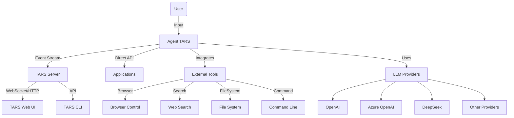
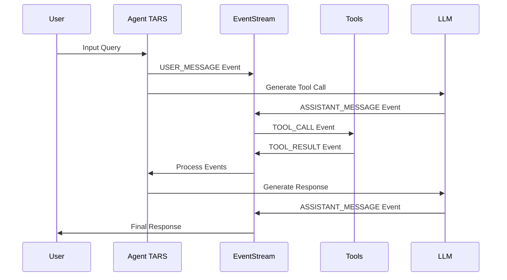
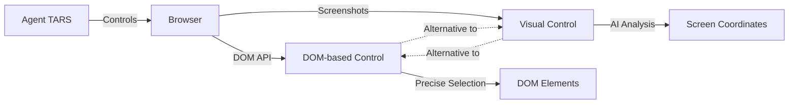
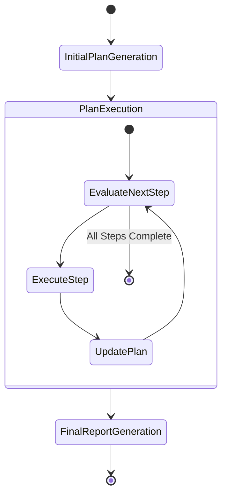
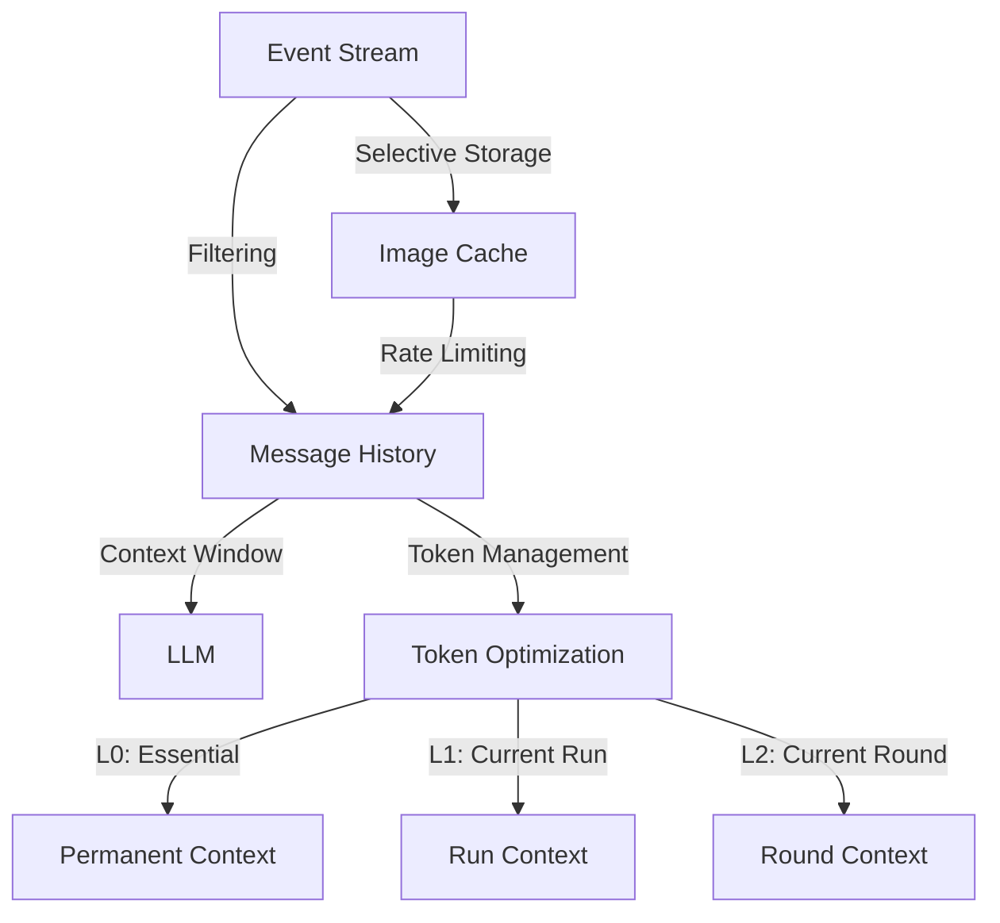
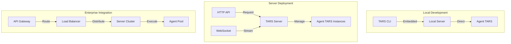

# Agent TARS

::: warning
This article was generated by AI based on early design documents. It is for reference only and will be completely rewritten in the future.
:::

## What's Agent TARS?

## Introduction

Agent TARS is an advanced, open-source multimodal AI agent framework designed to bridge the gap between powerful language models and real-world tools. Developed with a focus on modularity, extensibility, and performance, Agent TARS enables seamless integration with various external systems including browsers, file systems, search engines, and command-line interfaces. This document provides a technical overview of Agent TARS's architecture, components, and capabilities.



## Core Architecture

Agent TARS is built upon an event-driven architecture, with the Event Stream as its central nervous system. This design enables real-time, asynchronous communication between components while maintaining a clean separation of concerns.

### Event Stream

The Event Stream is the foundation of Agent TARS's architecture, serving as the communication backbone between all components. Events flow through the system in a standardized format, enabling seamless integration of various modules.



### Key Event Types

- **USER_MESSAGE**: Input from the user
- **ASSISTANT_MESSAGE**: Output from the LLM
- **TOOL_CALL**: Request to execute a tool
- **TOOL_RESULT**: Result from tool execution
- **ENVIRONMENT_INPUT**: Context from the environment (e.g., screenshots)
- **PLAN_START/UPDATE/FINISH**: Planning-related events for complex tasks

## Tool Integration System

Agent TARS employs a sophisticated tool integration system that allows it to interact with various external systems through standardized interfaces.

### Browser Control

Agent TARS supports dual approaches to browser control:

1.  **DOM-based control** via MCP Server Browser: Precise manipulation through DOM selectors
1.  **Visual control** via GUI Agent: AI-driven interaction based on screenshot analysis



### MCP Integration

The Model Context Protocol (MCP) provides a standardized way for Agent TARS to integrate with external tools and data sources. This allows Agent TARS to access:

- File system operations
- Command execution
- Web search capabilities
- Browser interaction

## Advanced Capabilities

### Planning System

Agent TARS incorporates a sophisticated planning system that breaks down complex tasks into manageable steps, enabling the agent to tackle multi-stage problems effectively.



### Deep Research Capabilities

Agent TARS can perform comprehensive research on topics by:

1.  Breaking down the research question
1.  Gathering information via search and web browsing
1.  Analyzing and synthesizing information
1.  Generating structured reports with citations

### Multimodal Support

Agent TARS handles various input and output modalities:

- **Text**: Natural language understanding and generation
- **Images**: Vision-based analysis and reasoning
- **Structured data**: Working with JSON, databases, etc.

## Technical Implementation

### Message History Management

Agent TARS maintains context through an intelligent message history system that:

- Preserves relevant context across multiple interactions
- Implements token optimization strategies
- Supports multimodal context (text + images)



### Tool Call Engine

Agent TARS supports multiple tool call paradigms through specialized engines:

1.  **Native Tool Call Engine**: Uses native function calling capabilities
1.  **Prompt Engineering Tool Call Engine**: Uses text-based pattern matching
1.  **Structured Outputs Tool Call Engine**: Uses JSON-based structured outputs

### Session Management

The Agent TARS Server implements robust session management to:

- Isolate user contexts
- Persist conversation history
- Enable stateful interactions
- Support request abortion and session recovery

## Deployment Architecture

Agent TARS can be deployed in various configurations:



## Model Provider System

Agent TARS implements a flexible model provider system that allows easy switching between different LLM providers:

- **OpenAI**: GPT-4o, GPT-4, etc.
- **Azure OpenAI**: Hosted models in Azure
- **DeepSeek**: DeepSeek models for specialized capabilities
- **Extensible**: Framework for adding custom providers

Configuration supports multiple approaches:

```ts
// Default provider configuration
const agent = new Agent({
  model: {
    use: {
      provider: 'openai',
      model: 'gpt-4o',
    },
  },
});

// Multiple provider configuration
const agent = new Agent({
  model: {
    providers: [
      {
        name: 'openai',
        apiKey: process.env.OPENAI_API_KEY,
        models: ['gpt-4o', 'gpt-4'],
      },
      {
        name: 'deepseek',
        baseURL: 'https://api.deepseek.com',
        apiKey: process.env.DEEPSEEK_API_KEY,
        models: ['deepseek-v1', 'deepseek-v2'],
      },
    ],
  },
});
```

## Integration Patterns

Agent TARS can be integrated into various applications using different patterns:

### In-Process Integration

Direct integration within a Node.js application:

```ts
import { Agent } from '@multimodal/agent';

const agent = new Agent(options);
const response = await agent.run('Research quantum computing advancements');
```

### Server-Client Integration

Using Agent TARS Server for distributed architecture:

```ts
// Server-side
const server = new AgentTARSServer({
  port: 3000,
  agentOptions: options,
});
await server.start();

// Client-side
const client = new AgentTARSClient('http://localhost:3000');
const response = await client.query('Research quantum computing advancements');
```

## Future Directions

Agent TARS continues to evolve with development focused on:

1.  **Enhanced reasoning capabilities**: Improving complex problem-solving
1.  **Expanded tool ecosystem**: Supporting more external systems
1.  **Advanced planning**: Hierarchical planning for complex tasks
1.  **Reinforcement learning from feedback**: Learning from user interactions
1.  **Memory and knowledge management**: Better persistence of learned information

## Conclusion

Agent TARS represents a significant advancement in AI agent frameworks, providing a robust, extensible platform for building intelligent applications that can interface with real-world tools and systems. By combining an event-driven architecture with sophisticated tool integration capabilities and multimodal support, Agent TARS offers developers a powerful framework for creating context-aware AI solutions that can understand, reason about, and interact with the world in increasingly sophisticated ways.
