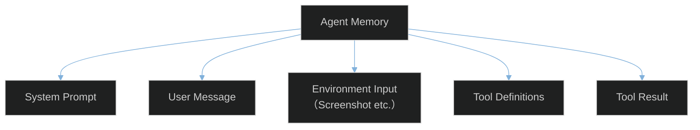
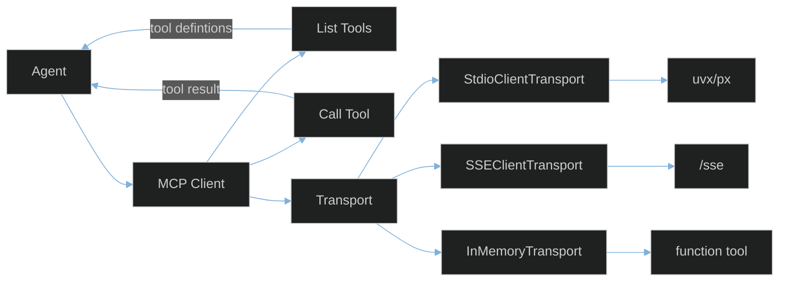

# Agent Memory 

## Agent Call MCP

| Model                            | Context window |
| -------------------------------- | -------------- |
| `Claude Sonnet 4`                | 200k           |
| `doubao-1.5-thinking-vision-pro` | 128k           |
| `GPT-4o`                         | 128k           |
