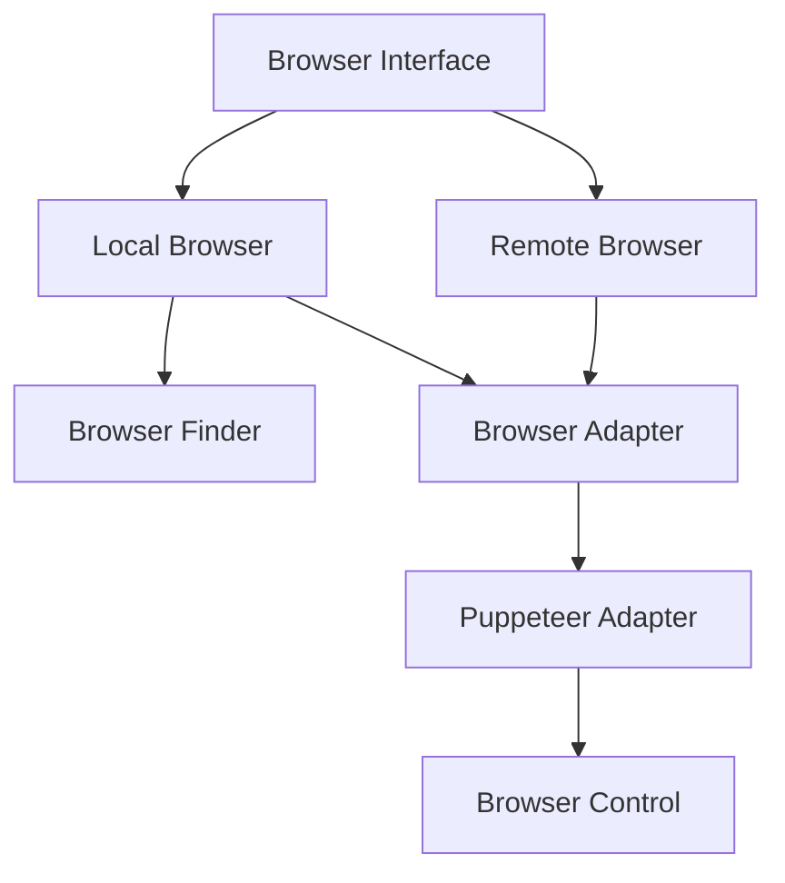

# @agent-infra/browser

A tiny Browser Control library based on [puppeteer](https://github.com/puppeteer/puppeteer), built for **Agent Tars**.

<p>
  <a href="https://npmjs.com/package/@agent-infra/browser?activeTab=readme"></a>
  <a href="https://npmcharts.com/compare/@agent-infra/browser?minimal=true"></a>
  <a href="https://nodejs.org/en/about/previous-releases"></a>
  <a href="https://github.com/bytedance/UI-TARS-desktop/blob/main/LICENSE"></a>
</p>

## Features

- 🔍 **Browser Detection** - Auto-detects installed browsers across platforms
- 🔄 **Remote Browser Support** - Connect to remote browser instances
- 🛡️ **Type Safety** - Written in TypeScript with full type definitions

## Architecture



## Installation

```bash
npm install @agent-infra/browser
# or
yarn add @agent-infra/browser
# or
pnpm add @agent-infra/browser
```

## Quick Start

```typescript
import { LocalBrowser } from '@agent-infra/browser';

async function main() {
  // Initialize browser
  const browser = new LocalBrowser();

  try {
    // Launch browser
    await browser.launch({ headless: false });

    // Create new page
    const page = await browser.createPage();

    // Navigate to URL
    await page.goto('https://example.com');

    // Take screenshot
    await page.screenshot({ path: 'example.png' });
  } finally {
    // Always close browser
    await browser.close();
  }
}
```

## Credits

Thanks to:

- [EGOIST](https://github.com/egoist) for creating a great AI chatbot product [ChatWise](https://chatwise.app/) from which we draw a lot of inspiration for browser detection functionality.
- The [puppeteer](https://github.com/puppeteer/puppeteer) project which helps us operate the browser better.
