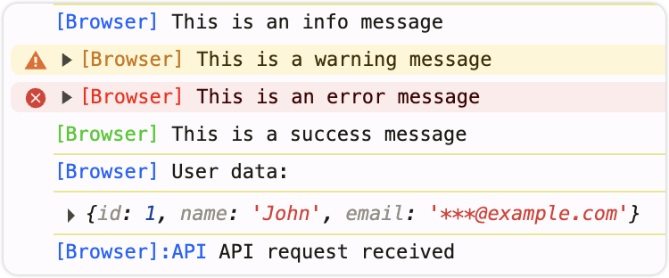
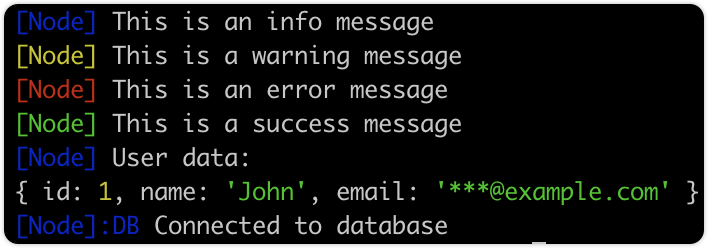

# @agent-infra/logger

<p>
  <a href="https://npmjs.com/package/@agent-infra/logger?activeTab=readme"></a>
  <a href="https://npmcharts.com/compare/@agent-infra/logger?minimal=true"></a>
  <a href="https://nodejs.org/en/about/previous-releases"></a>
  <a href="https://github.com/bytedance/UI-TARS-desktop/blob/main/LICENSE"></a>
</p>

A tiny, powerful isomorphic logger for both Node.js and browser environments. built for **Agent Tars**.

| Browser                                 | Node.js                           |
| --------------------------------------- | --------------------------------- |
|  |  |

## Features

- **Isomorphic**: Works seamlessly in both Node.js and browser environments
- **Colorful Output**: Automatic color support for different platforms
- **Hierarchical Logging**: Create nested loggers with prefixes
- **Data Handling**: Log structured data with optional transformation
- **Zero Dependencies**: Lightweight with no external runtime dependencies
- **TypeScript Support**: Full type definitions included
- **Log Levels**: Fine-grained control over logging verbosity

## Installation

```bash
npm install @agent-infra/logger
# or
yarn add @agent-infra/logger
# or
pnpm add @agent-infra/logger
```

## Quick Start

```typescript
import { ConsoleLogger } from '@agent-infra/logger';

// Create a logger with a prefix
const logger = new ConsoleLogger('[App]');

// Basic logging
logger.info('Server started');
logger.warn('Resource usage high');
logger.error('Database connection failed');
logger.success('Task completed successfully');

// Log with structured data
logger.infoWithData(
  'User data:',
  { id: 1, name: 'John', email: 'john@example.com' },
  // Optional transformer to mask sensitive data
  (user) => ({ ...user, email: '***@example.com' }),
);

// Create a child logger for a specific component
const dbLogger = logger.spawn('Database');
dbLogger.info('Connected to database'); // Outputs: [App:Database] Connected to database
```

## API Reference

### Logger

Main logger type.

| Method                                                                        | Description                                               |
| ----------------------------------------------------------------------------- | --------------------------------------------------------- |
| `log(...args: any[])`                                                         | Basic logging, similar to console.log                     |
| `info(message: string)`                                                       | Log informational message (blue prefix)                   |
| `warn(message: string)`                                                       | Log warning message (yellow prefix)                       |
| `error(message: string)`                                                      | Log error message (red prefix)                            |
| `success(message: string)`                                                    | Log success message (green prefix)                        |
| `infoWithData<T>(message: string, data?: T, transformer?: (value: T) => any)` | Log message with associated data and optional transformer |
| `spawn(prefix: string)`                                                       | Create a new logger instance with additional prefix       |
| `setLevel(level: LogLevel)`                                                   | Set the current log level                                 |
| `getLevel()`                                                                  | Get the current log level                                 |

### LogLevel

Controls the verbosity of logging output.

```typescript
enum LogLevel {
  DEBUG = 0,   // Most verbose, includes all logs
  INFO = 1,    // Standard information messages
  SUCCESS = 2, // Success messages and operations
  WARN = 3,    // Warning messages
  ERROR = 4,   // Error messages
  SILENT = 5   // No logs will be displayed
}
```

### defaultLogger

The empty logger that implements the Logger interface but does nothing.

### ConsoleLogger

The main logger implementation with colored console output.

## Usage

### Log Levels

Control verbosity with log levels:

```ts
import { ConsoleLogger, LogLevel } from '@agent-infra/logger';

const logger = new ConsoleLogger('[App]');

// Set log level
logger.setLevel(LogLevel.WARN); // Only WARN and ERROR will be shown

// These won't be displayed
logger.debug('Debug message');
logger.info('Info message');
logger.success('Success message');

// These will be displayed
logger.warn('Warning message');
logger.error('Error message');

// Get current log level
const currentLevel = logger.getLevel(); // Returns LogLevel.WARN
```

### Data Logging with Transformation

The `infoWithData` method allows logging structured data with optional transformation:

```typescript
// Log data with optional transformation
logger.infoWithData(
  'User profile:',
  { id: 123, name: 'Alice', email: 'alice@example.com', password: 'secret123' },
  // Optional transformer to mask sensitive data
  (data) => ({ ...data, password: '********' }),
);
```

### Hierarchical Loggers

Create nested loggers with the `spawn` method for better organization:

```ts
// Create parent logger
const appLogger = new ConsoleLogger('[App]');

// Create child loggers for different components
const authLogger = appLogger.spawn('Auth');
const dbLogger = appLogger.spawn('Database');
const apiLogger = appLogger.spawn('API');

// Usage
authLogger.info('User authenticated'); // Outputs: [App:Auth] User authenticated
dbLogger.error('Connection failed'); // Outputs: [App:Database] Connection failed
apiLogger.warn('Rate limit reached'); // Outputs: [App:API] Rate limit reached
```

### Advanced Usage

#### Environment-Specific Configuration

Configure different log levels based on environment:

```typescript
import { ConsoleLogger, LogLevel } from '@agent-infra/logger';

// Create base logger
const logger = new ConsoleLogger('[App]');

// Configure based on environment
if (process.env.NODE_ENV === 'production') {
  logger.setLevel(LogLevel.WARN); // Only show warnings and errors in production
} else if (process.env.NODE_ENV === 'test') {
  logger.setLevel(LogLevel.ERROR); // Only show errors in test
} else {
  logger.setLevel(LogLevel.DEBUG); // Show all logs in development
}
```

#### Integration with Error Tracking

Combine with error tracking services:

```typescript
import { ConsoleLogger } from '@agent-infra/logger';
import * as Sentry from '@sentry/browser'; // Example error tracking

const logger = new ConsoleLogger('[App]');

// Override error method to also report to Sentry
const originalError = logger.error;
logger.error = function(...args) {
  // Call original implementation
  originalError.apply(this, args);
  
  // Report to error tracking
  if (args[0] && typeof args[0] === 'string') {
    Sentry.captureMessage(args[0], Sentry.Severity.Error);
  }
};
```

#### Custom Color Themes

You can modify the CSS_COLOR_VALUES in your application to customize colors:

```typescript
import { ConsoleLogger, CSS_COLOR_VALUES } from '@agent-infra/logger';

// Override default colors with your theme
Object.assign(CSS_COLOR_VALUES, {
  blue: '#3498db',
  green: '#2ecc71',
  red: '#e74c3c',
  yellow: '#f39c12'
});

const logger = new ConsoleLogger('[MyApp]');
```

## Best Practices

### Organizing Loggers

For larger applications, organize loggers by feature or module:

```typescript
// logger.ts
import { ConsoleLogger, LogLevel } from '@agent-infra/logger';

// Create root logger
const rootLogger = new ConsoleLogger('[MyApp]');

// Set level based on environment
rootLogger.setLevel(
  process.env.NODE_ENV === 'production' ? LogLevel.WARN : LogLevel.INFO
);

// Create and export feature-specific loggers
export const authLogger = rootLogger.spawn('Auth');
export const apiLogger = rootLogger.spawn('API');
export const dbLogger = rootLogger.spawn('DB');
export const uiLogger = rootLogger.spawn('UI');
```

### Consistent Log Formats

For machine-parseable logs, use consistent formats:

```typescript
import { ConsoleLogger } from '@agent-infra/logger';

const logger = new ConsoleLogger('[API]');

// Log structured events consistently
function logApiEvent(eventType, data) {
  const event = {
    timestamp: new Date().toISOString(),
    type: eventType,
    ...data
  };
  
  logger.infoWithData(`API ${eventType}`, event);
}

// Usage
logApiEvent('request', { 
  method: 'GET', 
  path: '/users', 
  duration: 120 
});
```

## License

Copyright (c) 2025 ByteDance, Inc. and its affiliates.

Licensed under the Apache License, Version 2.0.
