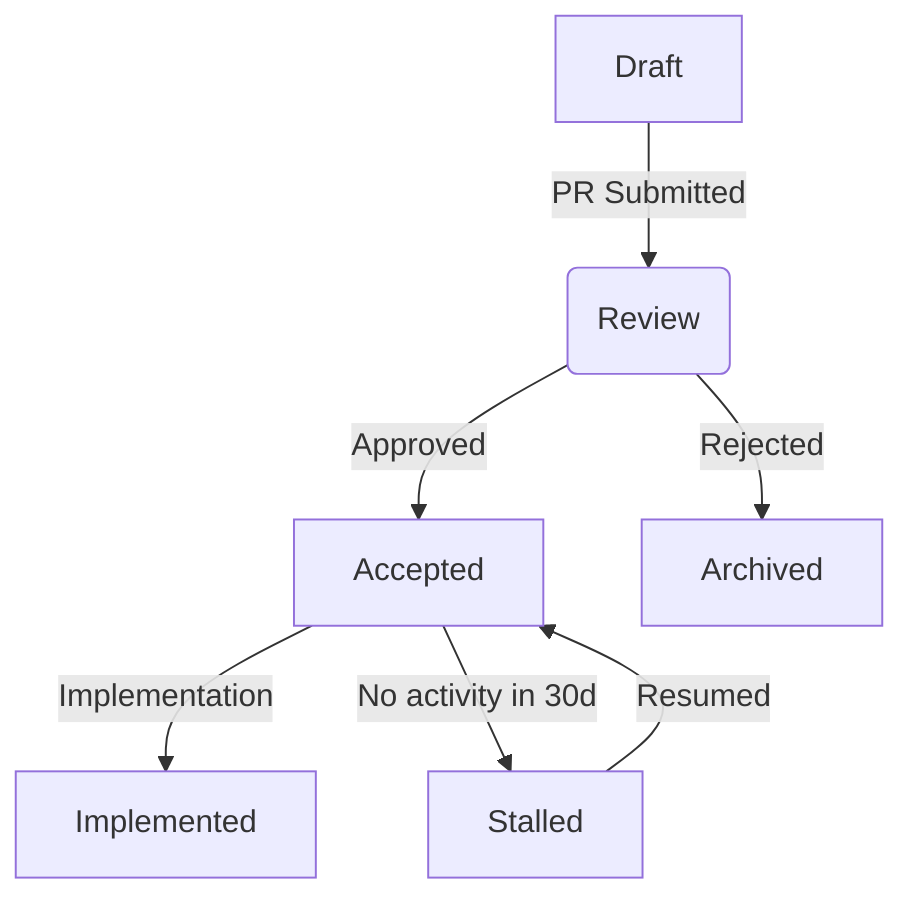

# UI-TARS-desktop RFCs

Most changes including bug fixes and documentation improvements can be handled through standard GitHub pull requests. However, substantial technical changes requiring cross-platform considerations (Windows/macOS/Linux) should follow this RFC process to ensure systematic design review.

## When RFC is Required

Consider initiating an RFC for changes involving:

- Architectural modifications
- Native API integrations
- Cross-platform behavior changes
- Major performance optimizations
- Security-sensitive implementations
- Breaking API changes

## RFC Lifecycle

### 1. Pre-Discussion

- Open a GitHub Discussion thread for initial concept validation
- Identify core maintainers (@mention platform specialists)

### 2. Draft Submission

1. Fork https://github.com/bytedance/UI-TARS-desktop
2. Copy `rfcs/template.md` to `rfcs/drafts/000-feature-name.md`
3. Submit draft PR with [WIP] prefix

### 3. Technical Review Phase

- Platform leads review for:
  - Windows compatibility
  - macOS security implications  
  - Linux packaging impacts
- Required checklist completion:
  - [ ] Performance analysis
  - [ ] Cross-platform testing strategy
  - [ ] Error handling documentation
  - [ ] Binary size impact

### 4. Final Comment Period

- Freeze feature scope
- Address final review comments
- Require 2/3 maintainer approvals (including at least one platform specialist)

### 5. Implementation Tracking

- Upon acceptance:
  - Create tracking issue with platform-specific tasks
  - Label with target version milestone
  - Assign platform implementation owners

### Status Transitions

## Key Modifications from Original Process

1. Added platform specialist review requirements
2. Extended review period for cross-platform analysis
3. Mandatory platform-specific checklists
4. Implementation tracking with ownership assignments
5. Stalled state for resource management
6. Visual workflow diagram

## Implementation Rules

- RFC authors receive implementation priority
- Platform-specific implementations must include:
  - Windows: MSI installer compatibility tests
  - macOS: Notarization validation
  - Linux: Snap/Flatpak packaging checks
- Binary size monitoring required for native modules

## References

Inspired by:

- [Electron RFC Process](https://www.electronjs.org/blog/rfc-process)
- [React Native Architecture Decisions](https://github.com/react-native-community/discussions-and-proposals)